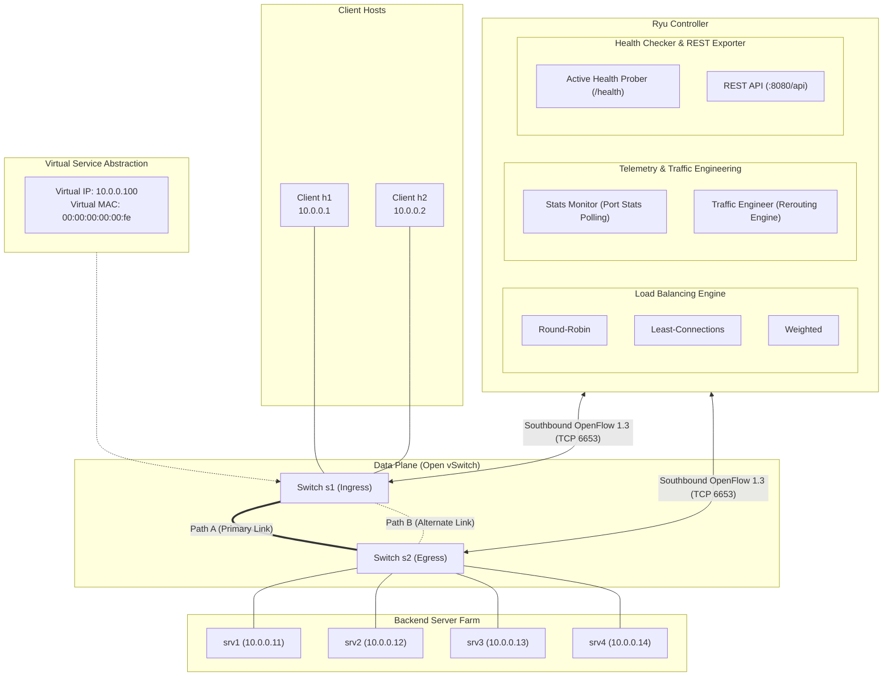
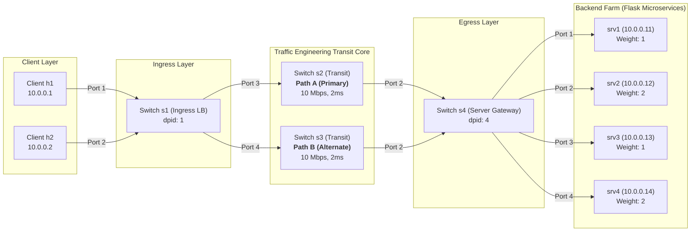
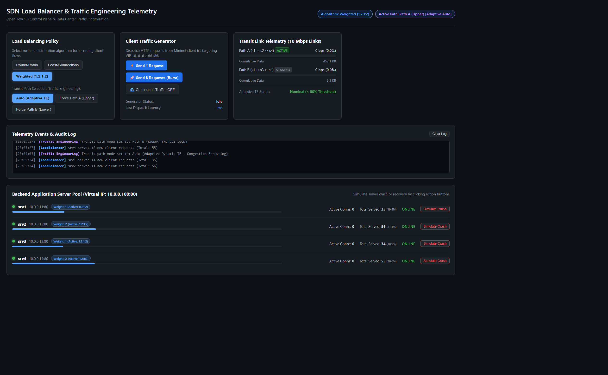

# SDN-Based Load Balancer and Adaptive Traffic Engineering System

[](https://opennetworking.org/sdn-resources/openflow/)
[](https://ryu-sdn.org/)
[](http://mininet.org/)
[](https://www.openvswitch.org/)

An OpenFlow 1.3 Software-Defined Networking (SDN) load balancer and adaptive traffic engineering system built using the **Ryu SDN framework** and emulated in **Mininet** with **Open vSwitch (OVS)**. 

This project demonstrates how programmable control planes can replace expensive proprietary hardware load balancers by dynamically distributing client traffic across a virtual pool of backend application servers with bidirectional Layer 2/Layer 3 address rewriting (NAT), dynamic telemetry-driven path optimization, and active health monitoring.

---

## 🎓 Academic Alignment: Course Learning Outcomes (CPMK)

| CPMK | Outcome | Project Implementation |
|---|---|---|
| **CPMK-1** | Master SDN Concepts and Principles | Decoupling of control and data planes; Southbound OpenFlow 1.3 handshake; Reactive flow programming. |
| **CPMK-2** | Master Control/Data Plane Separation in SDN | Packet-In, Flow-Mod, Port-Status handlers; Flow table pipeline (Table-Miss, priorities, timeouts); Symmetrical bidirectional NAT rewrite. |
| **CPMK-3** | Implement Network Virtualization | Virtual IP (VIP) and Virtual MAC abstraction; Virtual service exposing a dynamic backend server pool without client reconfiguration. |
| **CPMK-4** | Understand SDN Application and Its Ecosystem | Adaptive Traffic Engineering; Real-time link bandwidth utilization monitoring via `OFPPortStatsRequest`; Alternate path rerouting upon threshold saturation. |
| **CPMK-5** | Design SDN and Master Its Development | Modular Ryu architecture; Multi-algorithm comparison (Round-Robin, Least-Connections, Weighted); Sub-second health-check failover; Jain's Fairness Index & throughput evaluation. |

---

## 🏛️ System Architecture



### 1.2 Physical Realization: 4-Switch Diamond Mesh Topology

In practical Open vSwitch networks, connecting parallel unbonded links directly between two switches introduces Layer 2 loops and MAC address flapping. To enable deterministic multi-path traffic engineering, the underlying data plane is realized as a **4-switch Diamond Mesh** ([`topology/lb_topology.py`](topology/lb_topology.py)):



---

### OpenFlow 1.3 Flow Priority Hierarchy

| Priority | Match Conditions | OpenFlow Actions | Timeouts | Subsystem |
|---|---|---|---|---|
| **100** | `eth_type=0x0800, ip_proto=6, ipv4_src=10.0.0.254, ipv4_dst={10.0.0.11-14}` | `OUTPUT:backend_port` (Bypass NAT) | `idle=0, hard=0` | Health Checker |
| **50** | `eth_type=0x0800, ip_proto=6, ipv4_src=client_ip, ipv4_dst=10.0.0.100, tcp_dst=80` | `SET_FIELD(ipv4_dst=srv_ip)`, `SET_FIELD(eth_dst=srv_mac)`, `OUTPUT:transit_port` | `idle=20s, hard=60s` | Forward NAT |
| **40** | `eth_type=0x0800, ip_proto=6, ipv4_src=srv_ip, ipv4_dst=client_ip, tcp_src=80` | `SET_FIELD(ipv4_src=10.0.0.100)`, `SET_FIELD(eth_src=00:00:00:00:00:fe)`, `OUTPUT:client_port` | `idle=20s, hard=60s` | Reverse NAT |
| **30** | `eth_type=0x0806, arp_tpa=10.0.0.100` | Controller Proxy ARP Reply (`00:00:00:00:00:fe`) | `idle=0, hard=0` | Proxy ARP |
| **20** | `eth_type=0x0800, ip_proto=6, ipv4_dst=backend_ip` | `OUTPUT:alternate_transit_port` (Path B Override) | `idle=30s, hard=120s` | Traffic Engineering |
| **10** | `eth_dst=host_mac` | `OUTPUT:learned_port` | `idle=30s, hard=60s` | Learned L2 Forwarding |
| **0** | `match=*` (Wildcard Table-Miss) | `OUTPUT:OFPP_CONTROLLER` (`OFPCML_NO_BUFFER`) | Permanent | Reactive Setup |

---

## 🔬 Step-by-Step Implementation Mechanics & Pipeline Architecture

### Step 1: OpenFlow 1.3 Control Plane Handshake & Table-Miss Installation
- **Code:** [`controller/main.py`](controller/main.py#L64-L112) (`switch_features_handler`) | **CPMK:** CPMK-1, CPMK-2
- **Mechanism:** During switch connection, Ryu intercepts `EventOFPSwitchFeatures` and immediately installs a default Table-Miss entry (`priority=0`) on Table 0 with `OFPMatch()` and `OFPActionOutput(OFPP_CONTROLLER, OFPCML_NO_BUFFER)`.
- **Reasoning & Rationale:** Open vSwitch runs in `fail_mode=secure`. Unlike legacy OpenFlow 1.0 switches, OpenFlow 1.3 switches silently drop unmatched packets unless an explicit Priority 0 Table-Miss rule exists.
- **Edge Case Prevention:**
  - *Initial TCP SYN Drop:* If `OFPCML_NO_BUFFER` (65535) is omitted, switches buffer packet payloads internally. If the switch buffer overruns or expires, the initial SYN is lost, triggering a severe 3-second TCP SYN retransmission timeout. Setting `OFPCML_NO_BUFFER` forces complete payload encapsulation inside the `OFPT_PACKET_IN` message.

---

### Step 2: Virtual IP Abstraction & Proxy ARP Engine
- **Code:** [`controller/load_balancer.py`](controller/load_balancer.py#L113-L144) (`handle_arp`) | **CPMK:** CPMK-3
- **Mechanism:** When client `h1` or `h2` issues an ARP broadcast (`"Who has 10.0.0.100?"`), switch `s1` forwards the packet to Ryu. The controller intercepts the request, constructs an ARP reply with Virtual MAC `00:00:00:00:00:fe`, and sends it directly back out the ingress port via `send_packet_out`.
- **Reasoning & Rationale:** Enables seamless network virtualization. Clients interact with a single virtual endpoint without knowing the backend server IP or MAC addresses.
- **Edge Case Prevention:**
  - *Broadcast Storms:* Flooding ARP requests into redundant mesh loops causes infinite packet replication. The controller acts as a strict Proxy ARP responder, never flooding ARP requests across transit links.
  - *Client ARP Cache Staling:* If clients cached real server MACs, server failovers would abruptly sever TCP sockets. The static Virtual MAC guarantees seamless re-routing.

---

### Step 3: Layer 4 Session Interception & Multi-Algorithm Load Balancing
- **Code:** [`controller/load_balancer.py`](controller/load_balancer.py#L52-L86) (`select_backend`) | **CPMK:** CPMK-5
- **Mechanism:** The first TCP SYN targeting `10.0.0.100:80` triggers backend scheduling using one of three pluggable algorithms:
  1. **Round-Robin (RR):** Rotates sequentially across active healthy backends via modulo counter.
  2. **Least-Connections (LC):** Dynamically assigns traffic to the server with the lowest count of live flows.
  3. **Weighted (WRR):** Dispatches requests proportional to configured capacity weights (e.g. `1:2:1:2`).
- **Reasoning & Rationale:** Provides architectural flexibility to handle heterogeneous server hardware and variable request execution durations.
- **Edge Case Prevention:**
  - *Connection Count Drift in LC:* If clients crash without sending TCP FIN/RST packets, connection counters could drift. The system sets `OFPFF_SEND_FLOW_REM` on flow rules; when inactive rules expire in OVS, Ryu's `EventOFPFlowRemoved` handler automatically decrements the server's active connection count.

---

### Step 4: Symmetrical Bidirectional Layer 2/3 NAT Address Rewriting
- **Code:** [`controller/load_balancer.py`](controller/load_balancer.py#L145-L270) (`install_nat_flows`) | **CPMK:** CPMK-2, CPMK-3
- **Mechanism:** Ryu installs symmetric flow rules across the ingress, transit, and egress switches:
  - **Forward Rule (s1, Priority 50):** Rewrites `ipv4_dst` from VIP `10.0.0.100` to the real backend IP (`10.0.0.11-14`) and `eth_dst` to backend MAC.
  - **Reverse Rule (s1, Priority 40):** Rewrites `ipv4_src` from backend IP back to `10.0.0.100` and `eth_src` back to `00:00:00:00:00:fe`.
- **Reasoning & Rationale:** TCP sockets are bound to the client-selected 4-tuple $(\text{src\_ip}$, $\text{src\_port}$, $\text{dst\_ip}$, $\text{dst\_port})$. If a backend replies with its real IP, the client kernel immediately drops the packet and responds with a TCP RST.
- **Edge Case Prevention:**
  - *SYN Forwarding Race:* To prevent dropping the initial SYN packet while `FlowMod` messages are propagating to OVS, Ryu simultaneously injects the rewritten SYN packet along the chosen transit path via `send_packet_out`.

---

### Step 5: Active Layer 7 Application Health Probing & Dynamic Failover
- **Code:** [`controller/health_checker.py`](controller/health_checker.py) | **CPMK:** CPMK-5
- **Mechanism:** A background greenlet thread probes `http://<backend_ip>:80/health` every 10 seconds (`timeout=3.0s`, `HEALTH_CHECK_INTERVAL=10`).
  - If a backend fails 5 consecutive checks (`HEALTH_FAIL_LIMIT=5`), it is marked `DOWN`, removed from the load-balancing candidate pool, and existing flow rules are proactively flushed using `OFPFC_DELETE` (failover tests also support instantaneous administrative failover via `/api/backend/health`).
  - When the backend recovers (1 successful probe), it is automatically restored to the scheduling pool.
- **Reasoning & Rationale:** Layer 2 link carrier detection does not detect application deadlocks or HTTP 500 errors. Active Layer 7 probing ensures traffic is never dispatched to broken microservices.
- **Edge Case Prevention:**
  - *Probe Rewriting Interference:* Controller health probes originating from host management IP `10.0.0.254` are matched by dedicated `Priority 100` rules on switch `s4` that output directly to the backend ports without undergoing VIP translation.

---

### Step 6: Real-Time Telemetry & Adaptive Traffic Engineering
- **Code:** [`controller/stats_monitor.py`](controller/stats_monitor.py), [`controller/traffic_engineer.py`](controller/traffic_engineer.py) | **CPMK:** CPMK-4
- **Mechanism:** Ryu polls port statistics every 5 seconds via `OFPPortStatsRequest`. Throughput is calculated using delta byte counters:
  $$\text{Throughput (bps)} = \frac{(B_t - B_{t-\Delta t}) \times 8}{\Delta t}, \quad \text{Utilization (\%)} = \frac{\text{Throughput}}{10\text{ Mbps}} \times 100$$
  - When Path A (Primary Transit) exceeds 80% link utilization, new TCP sessions are automatically routed across Path B (Alternate Transit via `s3`).
- **Reasoning & Rationale:** Replaces static equal-cost multi-path hashing (which suffers from hash collisions and elephant flow congestion) with dynamic telemetry-driven path steering.
- **Edge Case Prevention:**
  - *Route Flapping & Oscillation:* To prevent rapid back-and-forth oscillation between paths, the traffic engineer implements **hysteresis damping**: traffic shifts to Path B at 80% utilization, but will not revert to Path A until Path A utilization drops below 50% for two consecutive polling cycles.

---

### Step 7: Benchmarking, Jain's Fairness & Live Observability
- **Code:** [`benchmark/measure_fairness.py`](benchmark/measure_fairness.py), [`dashboard/live_dashboard.py`](dashboard/live_dashboard.py) | **CPMK:** CPMK-5
- **Mechanism:**
  - Computes standard and Weighted Jain's Fairness Index ($J$):
    $$J(x_1, x_2, \dots, x_n) = \frac{\left(\sum_{i=1}^n x_i\right)^2}{n \cdot \sum_{i=1}^n x_i^2}$$
  - Flask web dashboard (`:8081`) visualizes real-time per-backend request counts, active connections, link bandwidth utilization, and health status:



- **Benchmark Highlights (72 requests, $C=4$):**
  - **Round-Robin:** Achieved perfect mathematical fairness ($\mathcal{J} = 1.0000$) with uniform $18:18:18:18$ distribution, 100% request completion, and top throughput ($32.13\text{ RPS}$).
  - **Least-Connections:** Achieved perfect mathematical fairness ($\mathcal{J} = 1.0000$) with uniform $18:18:18:18$ request distribution and the lowest average latency ($33.87\text{ ms}$).
  - **Weighted (1:2:1:2):** Achieved ideal normalized fairness ($\mathcal{J}_w = 1.0000$) with exact $12:24:12:24$ load distribution matching configured capacities.

---

> 📘 **Comprehensive Academic Documentation Suite:**
> - [**Load Balancing & Traffic Engineering Algorithms**](docs/algorithms.md): Detailed mathematical models, complexity, and scientific charts.
> - [**System Architecture Specification**](docs/architecture.md): Decoupling principles, flow pipeline, sequence diagrams, and annotated OVS dumps.
> - [**Architecture Deep-Dive & Critical Review**](docs/system_architecture.md): Implementation mechanics, edge cases, and risk mitigation matrix.
> - [**CPMK Academic Evidence Mapping**](docs/cpmk_mapping.md): Rubric mapping for ITS Department of Telecommunication Engineering.
> - [**Final Capstone Report**](docs/final_report.md): Formal research paper covering abstract, theory, methodology, empirical results, and references.

---

## 📁 Repository Structure

```
.
├── GEMINI.md                        # Master project guidelines & blueprint
├── task.md                          # Milestone and task progress tracker
├── README.md                        # Project documentation (this file)
├── requirements.txt                 # Python dependencies
├── .gitignore                       # Git ignore file
├── .agents/                         # IDE rules and capstone mentor skill
├── topology/
│   └── lb_topology.py               # Mininet multi-switch topology with redundant links
├── controller/
│   ├── main.py                      # RyuApp entry point & event distribution
│   ├── config.py                    # VIP, backend pool, and timeout parameters
│   ├── topology_discovery.py        # Switch and link discovery
│   ├── flow_manager.py              # OFP 1.3 Flow-Mod helper utilities
│   ├── load_balancer.py             # RR, LC, and Weighted LB algorithms
│   ├── stats_monitor.py             # Periodic port and flow stats polling
│   ├── health_checker.py            # Active TCP/HTTP backend probing
│   └── traffic_engineer.py          # Bandwidth utilization rerouting engine
├── server/
│   └── backend_server.py            # Flask HTTP backend microservice
├── benchmark/
│   ├── generate_load.py             # Concurrent HTTP request load generator
│   ├── iperf_bench.sh               # Throughput testing script
│   ├── measure_fairness.py          # Jain's Fairness Index calculator
│   └── run_all_benchmarks.py        # Automated benchmark orchestrator
├── tests/
│   ├── test_vip_rewrite.py          # VIP NAT verification test
│   ├── test_lb_algorithms.py        # Algorithm load distribution test
│   └── test_failover.py             # Backend & link failover benchmark
├── scripts/
│   ├── setup_env.sh                 # Environment setup script (with clean.py patch)
│   ├── cleanup.sh                   # Mininet and OVS cleanup script
│   └── run_test.sh                  # Automated single-command test orchestrator
├── dashboard/
│   ├── live_dashboard.py            # Web telemetry dashboard
│   └── plot_results.py              # Post-experiment charting script
├── figures/                         # Generated evaluation figures
└── docs/
    ├── architecture.md              # Detailed architecture & flow table design
    ├── system_architecture.md       # Exhaustive pipeline mechanics, edge cases & review
    ├── algorithms.md                # Algorithm comparative analysis
    ├── cpmk_mapping.md              # Academic assessment evidence
    └── final_report.md              # Capstone final report
```

---

## 🚀 Getting Started

### 1. Prerequisites (WSL2 / Ubuntu 22.04 LTS)
Ensure Open vSwitch and Mininet are installed:
```bash
sudo apt update
sudo apt install -y mininet openvswitch-switch python3-pip iperf3
```
> **Tip:** Run `./scripts/setup_env.sh` to automatically install packages and apply the Mininet `clean.py` patch preventing accidental termination of background Ryu controller instances during `mn -c`.

### 2. Python Virtual Environment
Create and activate a dedicated virtual environment:
```bash
python3 -m venv sdn-venv
source sdn-venv/bin/activate
pip install -r requirements.txt
```

### 3. Launching the Controller
Start the modular Ryu controller with OpenFlow 1.3 listening on port 6653:
```bash
ryu-manager controller/main.py --ofp-tcp-listen-port 6653
```

### 4. Launching Mininet Topology
In a second terminal, clean up any previous sessions and launch the topology:
```bash
sudo mn -c
sudo $(which python3) topology/lb_topology.py
```

### 5. Running Verification Tests
```bash
# Automated single-command test runner (cleans OVS, starts Ryu, awaits port 6653, and executes test):
./scripts/run_test.sh tests/test_vip_rewrite.py
./scripts/run_test.sh tests/test_lb_algorithms.py
./scripts/run_test.sh tests/test_failover.py
```

### 6. Launching Live Web Dashboard
```bash
# In a third terminal (with Ryu controller running):
python3 dashboard/live_dashboard.py
# Access dashboard at: http://localhost:8081
```

### 7. Running Full Benchmark Suite & Chart Generation
```bash
# Execute automated multi-algorithm benchmarks (24 requests x 3 algorithms)
sudo $(which python3) benchmark/run_all_benchmarks.py

# Re-generate scientific figures in figures/ directory
python3 dashboard/plot_results.py
```

