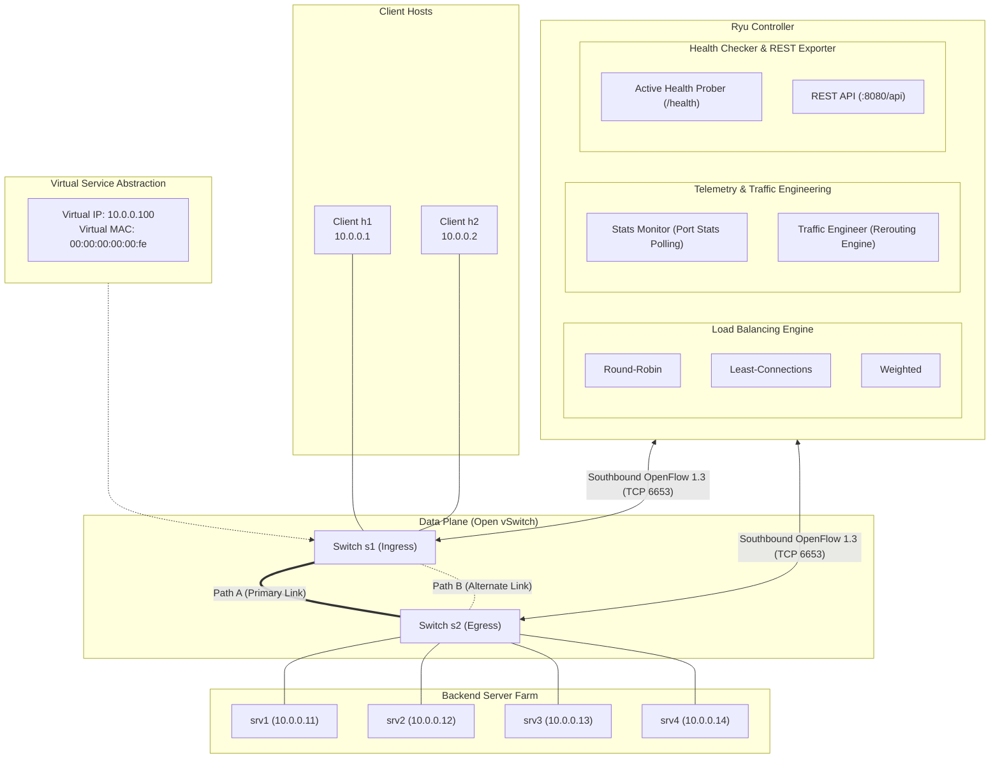
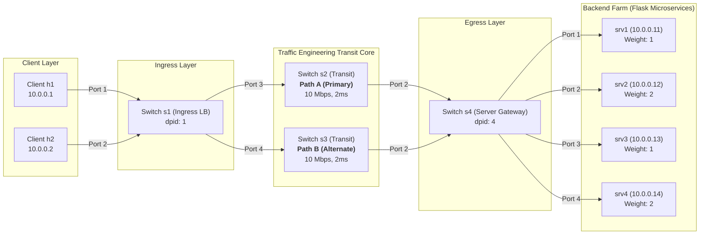

# SDN-Based Load Balancer and Adaptive Traffic Engineering System

[](https://opennetworking.org/sdn-resources/openflow/)
[](https://ryu-sdn.org/)
[](http://mininet.org/)
[](https://www.openvswitch.org/)

An OpenFlow 1.3 Software-Defined Networking (SDN) load balancer and adaptive traffic engineering system built using the **Ryu SDN framework** and emulated in **Mininet** with **Open vSwitch (OVS)**. 

This project demonstrates how programmable control planes can replace expensive proprietary hardware load balancers by dynamically distributing client traffic across a virtual pool of backend application servers with bidirectional Layer 2/Layer 3 address rewriting (NAT), dynamic telemetry-driven path optimization, and active health monitoring.

---

## 🎓 Academic Alignment: Course Learning Outcomes (CPMK)

| CPMK | Outcome | Project Implementation |
|---|---|---|
| **CPMK-1** | Master SDN Concepts and Principles | Decoupling of control and data planes; Southbound OpenFlow 1.3 handshake; Reactive flow programming. |
| **CPMK-2** | Master Control/Data Plane Separation in SDN | Packet-In, Flow-Mod, Port-Status handlers; Flow table pipeline (Table-Miss, priorities, timeouts); Symmetrical bidirectional NAT rewrite. |
| **CPMK-3** | Implement Network Virtualization | Virtual IP (VIP) and Virtual MAC abstraction; Virtual service exposing a dynamic backend server pool without client reconfiguration. |
| **CPMK-4** | Understand SDN Application and Its Ecosystem | Adaptive Traffic Engineering; Real-time link bandwidth utilization monitoring via `OFPPortStatsRequest`; Alternate path rerouting upon threshold saturation. |
| **CPMK-5** | Design SDN and Master Its Development | Modular Ryu architecture; Multi-algorithm comparison (Round-Robin, Least-Connections, Weighted); Sub-second health-check failover; Jain's Fairness Index & throughput evaluation. |

---

## 🏛️ System Architecture



### 1.2 Physical Realization: 4-Switch Diamond Mesh Topology

In practical Open vSwitch networks, connecting parallel unbonded links directly between two switches introduces Layer 2 loops and MAC address flapping. To enable deterministic multi-path traffic engineering, the underlying data plane is realized as a **4-switch Diamond Mesh** ([`topology/lb_topology.py`](topology/lb_topology.py)):



---

### OpenFlow 1.3 Flow Priority Hierarchy

| Priority | Match Conditions | OpenFlow Actions | Timeouts | Subsystem |
|---|---|---|---|---|
| **100** | `eth_type=0x0800, ip_proto=6, ipv4_src=10.0.0.254, ipv4_dst={10.0.0.11-14}` | `OUTPUT:backend_port` (Bypass NAT) | `idle=0, hard=0` | Health Checker |
| **50** | `eth_type=0x0800, ip_proto=6, ipv4_src=client_ip, ipv4_dst=10.0.0.100, tcp_dst=80` | `SET_FIELD(ipv4_dst=srv_ip)`, `SET_FIELD(eth_dst=srv_mac)`, `OUTPUT:transit_port` | `idle=20s, hard=60s` | Forward NAT |
| **40** | `eth_type=0x0800, ip_proto=6, ipv4_src=srv_ip, ipv4_dst=client_ip, tcp_src=80` | `SET_FIELD(ipv4_src=10.0.0.100)`, `SET_FIELD(eth_src=00:00:00:00:00:fe)`, `OUTPUT:client_port` | `idle=20s, hard=60s` | Reverse NAT |
| **30** | `eth_type=0x0806, arp_tpa=10.0.0.100` | Controller Proxy ARP Reply (`00:00:00:00:00:fe`) | `idle=0, hard=0` | Proxy ARP |
| **20** | `eth_type=0x0800, ip_proto=6, ipv4_dst=backend_ip` | `OUTPUT:alternate_transit_port` (Path B Override) | `idle=30s, hard=120s` | Traffic Engineering |
| **10** | `eth_dst=host_mac` | `OUTPUT:learned_port` | `idle=30s, hard=60s` | Learned L2 Forwarding |
| **0** | `match=*` (Wildcard Table-Miss) | `OUTPUT:OFPP_CONTROLLER` (`OFPCML_NO_BUFFER`) | Permanent | Reactive Setup |

---

## 🔬 Step-by-Step Implementation Mechanics & Pipeline Architecture

### Step 1: OpenFlow 1.3 Control Plane Handshake & Table-Miss Installation
- **Code:** [`controller/main.py`](controller/main.py#L64-L112) (`switch_features_handler`) | **CPMK:** CPMK-1, CPMK-2
- **Mechanism:** During switch connection, Ryu intercepts `EventOFPSwitchFeatures` and immediately installs a default Table-Miss entry (`priority=0`) on Table 0 with `OFPMatch()` and `OFPActionOutput(OFPP_CONTROLLER, OFPCML_NO_BUFFER)`.
- **Reasoning & Rationale:** Open vSwitch runs in `fail_mode=secure`. Unlike legacy OpenFlow 1.0 switches, OpenFlow 1.3 switches silently drop unmatched packets unless an explicit Priority 0 Table-Miss rule exists.
- **Edge Case Prevention:**
  - *Initial TCP SYN Drop:* If `OFPCML_NO_BUFFER` (65535) is omitted, switches buffer packet payloads internally. If the switch buffer overruns or expires, the initial SYN is lost, triggering a severe 3-second TCP SYN retransmission timeout. Setting `OFPCML_NO_BUFFER` forces complete payload encapsulation inside the `OFPT_PACKET_IN` message.

---

### Step 2: Virtual IP Abstraction & Proxy ARP Engine
- **Code:** [`controller/load_balancer.py`](controller/load_balancer.py#L113-L144) (`handle_arp`) | **CPMK:** CPMK-3
- **Mechanism:** When client `h1` or `h2` issues an ARP broadcast (`"Who has 10.0.0.100?"`), switch `s1` forwards the packet to Ryu. The controller intercepts the request, constructs an ARP reply with Virtual MAC `00:00:00:00:00:fe`, and sends it directly back out the ingress port via `send_packet_out`.
- **Reasoning & Rationale:** Enables seamless network virtualization. Clients interact with a single virtual endpoint without knowing the backend server IP or MAC addresses.
- **Edge Case Prevention:**
  - *Broadcast Storms:* Flooding ARP requests into redundant mesh loops causes infinite packet replication. The controller acts as a strict Proxy ARP responder, never flooding ARP requests across transit links.
  - *Client ARP Cache Staling:* If clients cached real server MACs, server failovers would abruptly sever TCP sockets. The static Virtual MAC guarantees seamless re-routing.

---

### Step 3: Layer 4 Session Interception & Multi-Algorithm Load Balancing
- **Code:** [`controller/load_balancer.py`](controller/load_balancer.py#L52-L86) (`select_backend`) | **CPMK:** CPMK-5
- **Mechanism:** The first TCP SYN targeting `10.0.0.100:80` triggers backend scheduling using one of three pluggable algorithms:
  1. **Round-Robin (RR):** Rotates sequentially across active healthy backends via modulo counter.
  2. **Least-Connections (LC):** Dynamically assigns traffic to the server with the lowest count of live flows.
  3. **Weighted (WRR):** Dispatches requests proportional to configured capacity weights (e.g. `1:2:1:2`).
- **Reasoning & Rationale:** Provides architectural flexibility to handle heterogeneous server hardware and variable request execution durations.
- **Edge Case Prevention:**
  - *Connection Count Drift in LC:* If clients crash without sending TCP FIN/RST packets, connection counters could drift. The system sets `OFPFF_SEND_FLOW_REM` on flow rules; when inactive rules expire in OVS, Ryu's `EventOFPFlowRemoved` handler automatically decrements the server's active connection count.

---

### Step 4: Symmetrical Bidirectional Layer 2/3 NAT Address Rewriting
- **Code:** [`controller/load_balancer.py`](controller/load_balancer.py#L145-L270) (`install_nat_flows`) | **CPMK:** CPMK-2, CPMK-3
- **Mechanism:** Ryu installs symmetric flow rules across the ingress, transit, and egress switches:
  - **Forward Rule (s1, Priority 50):** Rewrites `ipv4_dst` from VIP `10.0.0.100` to the real backend IP (`10.0.0.11-14`) and `eth_dst` to backend MAC.
  - **Reverse Rule (s1, Priority 40):** Rewrites `ipv4_src` from backend IP back to `10.0.0.100` and `eth_src` back to `00:00:00:00:00:fe`.
- **Reasoning & Rationale:** TCP sockets are bound to the client-selected 4-tuple (`src_ip`, `src_port`, `dst_ip`, `dst_port`). If a backend replies with its real IP, the client kernel immediately drops the packet and responds with a TCP RST.
- **Edge Case Prevention:**
  - *SYN Forwarding Race:* To prevent dropping the initial SYN packet while `FlowMod` messages are propagating to OVS, Ryu simultaneously injects the rewritten SYN packet along the chosen transit path via `send_packet_out`.

---

### Step 5: Active Layer 7 Application Health Probing & Dynamic Failover
- **Code:** [`controller/health_checker.py`](controller/health_checker.py) | **CPMK:** CPMK-5
- **Mechanism:** A background greenlet thread probes `http://<backend_ip>:80/health` every 10 seconds (`timeout=3.0s`, `HEALTH_CHECK_INTERVAL=10`).
  - If a backend fails 5 consecutive checks (`HEALTH_FAIL_LIMIT=5`), it is marked `DOWN`, removed from the load-balancing candidate pool, and existing flow rules are proactively flushed using `OFPFC_DELETE` (failover tests also support instantaneous administrative failover via `/api/backend/health`).
  - When the backend recovers (1 successful probe), it is automatically restored to the scheduling pool.
- **Reasoning & Rationale:** Layer 2 link carrier detection does not detect application deadlocks or HTTP 500 errors. Active Layer 7 probing ensures traffic is never dispatched to broken microservices.
- **Edge Case Prevention:**
  - *Probe Rewriting Interference:* Controller health probes originating from host management IP `10.0.0.254` are matched by dedicated `Priority 100` rules on switch `s4` that output directly to the backend ports without undergoing VIP translation.

---

### Step 6: Real-Time Telemetry & Adaptive Traffic Engineering
- **Code:** [`controller/stats_monitor.py`](controller/stats_monitor.py), [`controller/traffic_engineer.py`](controller/traffic_engineer.py) | **CPMK:** CPMK-4
- **Mechanism:** Ryu polls port statistics every 5 seconds via `OFPPortStatsRequest`. Throughput and link utilization are calculated using delta byte counters:

  $$\text{Throughput (bps)} = \frac{(B_t - B_{t-\Delta t}) \times 8}{\Delta t}$$

  $$\text{Utilization} = \frac{\text{Throughput}}{10\text{ Mbps}} \times 100$$

  - When Path A (Primary Transit) exceeds 80% link utilization, new TCP sessions are automatically routed across Path B (Alternate Transit via `s3`).
- **Reasoning & Rationale:** Replaces static equal-cost multi-path hashing (which suffers from hash collisions and elephant flow congestion) with dynamic telemetry-driven path steering.
- **Edge Case Prevention:**
  - *Route Flapping & Oscillation:* To prevent rapid back-and-forth oscillation between paths, the traffic engineer implements **hysteresis damping**: traffic shifts to Path B at 80% utilization, but will not revert to Path A until Path A utilization drops below 50% for two consecutive polling cycles.

---

### Step 7: Benchmarking, Jain's Fairness & Live Observability
- **Code:** [`benchmark/measure_fairness.py`](benchmark/measure_fairness.py), [`dashboard/live_dashboard.py`](dashboard/live_dashboard.py) | **CPMK:** CPMK-5
- **Mechanism:**
  - Computes standard and Weighted Jain's Fairness Index ($J$):
    $$J(x_1, x_2, \dots, x_n) = \frac{\left(\sum_{i=1}^n x_i\right)^2}{n \cdot \sum_{i=1}^n x_i^2}$$
  - Flask web dashboard (`:8081`) visualizes real-time per-backend request counts, active connections, link bandwidth utilization, and health status:


- **Benchmark Highlights (72 requests, concurrency C = 4):**
  - **Round-Robin:** Achieved perfect mathematical fairness (JFI = 1.0000) with uniform 18:18:18:18 distribution, 100% request completion, and top throughput (32.13 RPS).
  - **Least-Connections:** Achieved perfect mathematical fairness (JFI = 1.0000) with uniform 18:18:18:18 request distribution and the lowest average latency (33.87 ms).
  - **Weighted (1:2:1:2):** Achieved ideal normalized fairness (Weighted JFI = 1.0000) with exact 12:24:12:24 load distribution matching configured capacities.

---

> 📘 **Comprehensive Academic Documentation Suite:**
> - [**Load Balancing & Traffic Engineering Algorithms**](docs/algorithms.md): Detailed mathematical models, complexity, and scientific charts.
> - [**System Architecture Specification**](docs/architecture.md): Decoupling principles, flow pipeline, sequence diagrams, and annotated OVS dumps.
> - [**Architecture Deep-Dive & Critical Review**](docs/system_architecture.md): Implementation mechanics, edge cases, and risk mitigation matrix.
> - [**CPMK Academic Evidence Mapping**](docs/cpmk_mapping.md): Rubric mapping for ITS Department of Telecommunication Engineering.
> - [**Final Capstone Report**](docs/final_report.md): Formal research paper covering abstract, theory, methodology, empirical results, and references.

---

## 📁 Repository Structure

```
.
├── GEMINI.md                        # Master project guidelines & blueprint
├── task.md                          # Milestone and task progress tracker
├── README.md                        # Project documentation (this file)
├── requirements.txt                 # Python dependencies
├── .gitignore                       # Git ignore file
├── .agents/                         # IDE rules and capstone mentor skill
├── topology/
│   └── lb_topology.py               # Mininet multi-switch topology with redundant links
├── controller/
│   ├── main.py                      # RyuApp entry point & event distribution
│   ├── config.py                    # VIP, backend pool, and timeout parameters
│   ├── topology_discovery.py        # Switch and link discovery
│   ├── flow_manager.py              # OFP 1.3 Flow-Mod helper utilities
│   ├── load_balancer.py             # RR, LC, and Weighted LB algorithms
│   ├── stats_monitor.py             # Periodic port and flow stats polling
│   ├── health_checker.py            # Active TCP/HTTP backend probing
│   └── traffic_engineer.py          # Bandwidth utilization rerouting engine
├── server/
│   └── backend_server.py            # Flask HTTP backend microservice
├── benchmark/
│   ├── generate_load.py             # Concurrent HTTP request load generator
│   ├── iperf_bench.sh               # Throughput testing script
│   ├── measure_fairness.py          # Jain's Fairness Index calculator
│   └── run_all_benchmarks.py        # Automated benchmark orchestrator
├── tests/
│   ├── test_vip_rewrite.py          # VIP NAT verification test
│   ├── test_lb_algorithms.py        # Algorithm load distribution test
│   └── test_failover.py             # Backend & link failover benchmark
├── scripts/
│   ├── setup_env.sh                 # Environment setup script (with clean.py patch)
│   ├── cleanup.sh                   # Mininet and OVS cleanup script
│   └── run_test.sh                  # Automated single-command test orchestrator
├── dashboard/
│   ├── live_dashboard.py            # Web telemetry dashboard
│   └── plot_results.py              # Post-experiment charting script
├── figures/                         # Generated evaluation figures
└── docs/
    ├── architecture.md              # Detailed architecture & flow table design
    ├── system_architecture.md       # Exhaustive pipeline mechanics, edge cases & review
    ├── algorithms.md                # Algorithm comparative analysis
    ├── cpmk_mapping.md              # Academic assessment evidence
    └── final_report.md              # Capstone final report
```

---

## 🚀 End-to-End Operational Guide (WSL2 & Windows PowerShell)

This guide provides a comprehensive, step-by-step operational workflow for running, testing, and benchmarking the SDN Load Balancer and Traffic Engineering platform. Every step includes dual-track command examples:
- 🐧 **Native WSL2 Terminal (Ubuntu 22.04 LTS Bash)**: For running directly inside an interactive WSL2 shell.
- 🪟 **Windows PowerShell (`wsl` CLI)**: For executing commands directly from Windows PowerShell without switching into an interactive Linux session.

---

### 🖥️ Architecture & Terminal Coordination

In a Software-Defined Network, the centralized control plane is physically separated from data plane forwarding. To observe real-time packet processing, telemetry, and live failover, standard operation coordinates four logical terminal roles:

| Terminal / Role | Component | Network Endpoints | Primary Function |
| :--- | :--- | :--- | :--- |
| **Terminal 1** | **Ryu SDN Controller** | `0.0.0.0:6653` (OpenFlow 1.3)<br>`0.0.0.0:8080` (WSGI REST API) | Runs event loops, installs flow tables, tracks active TCP connections, and calculates port telemetry. |
| **Terminal 2** | **Mininet Data Plane** | OVS Switches `s1`–`s4`<br>Hosts `h1`–`h2`, `s1_srv`–`s4_srv` | Emulates diamond topology, runs 4 background Flask HTTP servers (`:80`), and exposes the interactive `mininet>` CLI. |
| **Terminal 3** | **Live Telemetry Dashboard** | `http://localhost:8081` (Flask Web UI) | Enterprise operations console displaying live topology, bandwidth gauges, JFI fairness meter, and server health. |
| **Terminal 4** | **Experimenter Console** | CLI Probes / REST Client | Injects HTTP traffic, triggers runtime algorithm changes, injects link congestion, and executes benchmark scripts. |

> 💡 **Environment & Path Mapping Reference:**
> - **Windows Host Path:** `E:\Projects\sdn-project`
> - **WSL2 Mount Path:** `/mnt/e/Projects/sdn-project`
> - **Python Virtualenv:** `~/sdn-venv` (or `/home/<username>/sdn-venv`)
> - **Localhost Port Binding:** WSL2 automatically forwards ports `6653`, `8080`, and `8081` to the Windows host, allowing direct browser access to `http://localhost:8081`.

---

### 📋 Step 1: System Prerequisites & Environment Setup

Ensure your WSL2 environment has the required Open vSwitch kernel modules, Mininet packages, and Python build dependencies.

#### 1.1 Check WSL2 Version
Open **Windows PowerShell** and confirm your Ubuntu distribution is running WSL Version 2:
```powershell
wsl -l -v
```
*(If your distribution indicates Version 1, upgrade with: `wsl --set-version Ubuntu-22.04 2`)*

#### 1.2 Install Required System Packages
Install Mininet, Open vSwitch, Python pip, virtual environment tools, and iperf3:

**🐧 Native WSL2 Terminal (Bash):**
```bash
sudo apt update
sudo apt install -y mininet openvswitch-switch python3-pip python3-venv iperf3
```

**🪟 Windows PowerShell (`wsl`):**
```powershell
wsl -u root apt update
wsl -u root apt install -y mininet openvswitch-switch python3-pip python3-venv iperf3
```

#### 1.3 Run Environment Setup & Mininet Patch
Execute [`./scripts/setup_env.sh`](scripts/setup_env.sh). This automated script:
1. Verifies that `mn`, `ovs-vsctl`, and `iperf3` are installed.
2. Ensures the `openvswitch-switch` daemon is active.
3. **Patches `/usr/lib/python3/dist-packages/mininet/clean.py`** to protect `ryu-manager` from accidental termination during `sudo mn -c`.
4. Creates a Python virtual environment at `~/sdn-venv` and installs all packages from [`requirements.txt`](requirements.txt).
5. Runs an import smoke test across `ryu`, `mininet`, `scapy`, `flask`, `matplotlib`, and `networkx`.

**🐧 Native WSL2 Terminal (Bash):**
```bash
cd /mnt/e/Projects/sdn-project
chmod +x scripts/*.sh
./scripts/setup_env.sh
```

**🪟 Windows PowerShell (`wsl`):**
```powershell
wsl -e bash -c "cd /mnt/e/Projects/sdn-project && chmod +x scripts/*.sh && ./scripts/setup_env.sh"
```

#### 1.4 Verify Open vSwitch Service Status
Ensure the Open vSwitch switch daemon is active:

**🐧 Native WSL2 Terminal (Bash):**
```bash
sudo service openvswitch-switch status
```

**🪟 Windows PowerShell (`wsl`):**
```powershell
wsl -u root service openvswitch-switch status
```
*(If the service is stopped, start it via `sudo service openvswitch-switch start` or `wsl -u root service openvswitch-switch start`.)*

---

### 🧪 Step 2: Automated Pre-Flight Test Suite

Before launching interactive daemons, execute the automated test runner to verify core OpenFlow 1.3 pipeline mechanics.

The helper script [`./scripts/run_test.sh`](scripts/run_test.sh) is completely self-contained:
1. Resets stale OVS bridges and cleans Mininet state via `./scripts/cleanup.sh`.
2. Starts Ryu in the background on port `6653`.
3. Waits until port `6653` is actively accepting TCP connections.
4. Executes the target test suite under `sudo`.
5. Gracefully terminates Ryu and cleans up on completion.

#### 2.1 Run Test 1: VIP NAT & L2/L3 Bidirectional Rewriting
Verifies ARP resolution for VIP (`10.0.0.100`), reactive Flow-Mod installation, client-to-backend IP/MAC rewrite, and reverse translation.

**🐧 Native WSL2 Terminal (Bash):**
```bash
cd /mnt/e/Projects/sdn-project
./scripts/run_test.sh tests/test_vip_rewrite.py
```

**🪟 Windows PowerShell (`wsl`):**
```powershell
wsl -e bash -c "cd /mnt/e/Projects/sdn-project && ./scripts/run_test.sh tests/test_vip_rewrite.py"
```

#### 2.2 Run Test 2: Multi-Algorithm Load Distribution
Validates request distribution and mathematical fairness for Round-Robin, Least-Connections, and Weighted (1:2:1:2) policies.

**🐧 Native WSL2 Terminal (Bash):**
```bash
cd /mnt/e/Projects/sdn-project
./scripts/run_test.sh tests/test_lb_algorithms.py
```

**🪟 Windows PowerShell (`wsl`):**
```powershell
wsl -e bash -c "cd /mnt/e/Projects/sdn-project && ./scripts/run_test.sh tests/test_lb_algorithms.py"
```

#### 2.3 Run Test 3: Backend & Link Failover Recovery
Validates sub-second failover when a backend server goes down and adaptive rerouting when core links fail.

**🐧 Native WSL2 Terminal (Bash):**
```bash
cd /mnt/e/Projects/sdn-project
./scripts/run_test.sh tests/test_failover.py
```

**🪟 Windows PowerShell (`wsl`):**
```powershell
wsl -e bash -c "cd /mnt/e/Projects/sdn-project && ./scripts/run_test.sh tests/test_failover.py"
```

---

### 🚀 Step 3: Launching the Full Production Stack (Interactive End-to-End)

To observe real-time SDN load balancing, traffic engineering, and live web telemetry, open **three terminal tabs**:

```
┌─────────────────────────────────┐   ┌─────────────────────────────────┐
│  TERMINAL 1: Ryu Controller     │   │  TERMINAL 2: Mininet Topology   │
│  Port 6653 (OFP) & 8080 (REST)  │   │  OVS Switches + 4 HTTP Backends │
└─────────────────────────────────┘   └─────────────────────────────────┘
                 │                                     │
                 ▼                                     ▼
┌─────────────────────────────────┐   ┌─────────────────────────────────┐
│  TERMINAL 3: Telemetry Dashboard│   │  TERMINAL 4: Experimenter / CLI │
│  http://localhost:8081 (Flask)  │   │  curl, REST API, Benchmarks     │
└─────────────────────────────────┘   └─────────────────────────────────┘
```

#### 3.1 Terminal 1: Launch Ryu SDN Controller
Starts the Ryu controller application on OpenFlow port `6653` and WSGI REST API on port `8080`:

**🐧 Native WSL2 Terminal (Bash):**
```bash
cd /mnt/e/Projects/sdn-project
source ~/sdn-venv/bin/activate
ryu-manager controller/main.py --ofp-tcp-listen-port 6653
```

**🪟 Windows PowerShell (`wsl`):**
```powershell
wsl -e bash -c "cd /mnt/e/Projects/sdn-project && source ~/sdn-venv/bin/activate && ryu-manager controller/main.py --ofp-tcp-listen-port 6653"
```

*Expected startup logs:*
```
[INFO] Loading app controller.main
[INFO] [RyuApp] SDN Load Balancer & Traffic Engineering Controller Initializing...
[INFO] [RyuApp] VIP: 10.0.0.100 (00:00:00:00:00:fe), Port: 80
[INFO] (WSGI) serving on http://0.0.0.0:8080
```

---

#### 3.2 Terminal 2: Launch Mininet Diamond Mesh Topology
Cleans any stale network namespaces and starts the Mininet topology (4 OVS switches `s1`–`s4`, 2 clients `h1`–`h2`, and 4 backend servers `s1_srv`–`s4_srv`):

**🐧 Native WSL2 Terminal (Bash):**
```bash
cd /mnt/e/Projects/sdn-project
sudo mn -c
sudo $(which python3) topology/lb_topology.py
```

**🪟 Windows PowerShell (`wsl`):**
```powershell
wsl -e bash -c "cd /mnt/e/Projects/sdn-project && sudo mn -c && sudo /home/$USER/sdn-venv/bin/python3 topology/lb_topology.py"
```

*Expected events:*
1. Terminal 2 displays the topology banner and enters the interactive `mininet>` prompt.
2. Terminal 1 logs switch handshakes: `[Switch s1-s4 connected] Table-miss flow installed`.
3. 4 background Flask HTTP backend servers are automatically spawned on `10.0.0.11`–`10.0.0.14:80`.

> **Note (Headless / Daemon Mode):** If you wish to run Mininet in daemon mode without an interactive CLI, pass `--no-cli`:
> ```powershell
> wsl -e bash -c "cd /mnt/e/Projects/sdn-project && sudo /home/$USER/sdn-venv/bin/python3 topology/lb_topology.py --no-cli"
> ```

---

#### 3.3 Terminal 3: Launch Live Telemetry Web Dashboard
Starts the real-time Flask operations console on port `8081`:

**🐧 Native WSL2 Terminal (Bash):**
```bash
cd /mnt/e/Projects/sdn-project
source ~/sdn-venv/bin/activate
python3 dashboard/live_dashboard.py
```

**🪟 Windows PowerShell (`wsl`):**
```powershell
wsl -e bash -c "cd /mnt/e/Projects/sdn-project && source ~/sdn-venv/bin/activate && python3 dashboard/live_dashboard.py"
```

*Accessing the Dashboard:*
Open your web browser on Windows (Chrome, Edge, Firefox) and navigate to:
👉 **`http://localhost:8081`**

The dashboard provides a complete NOC-grade operations interface:
- **Topology & Health Map:** Real-time visual status of `s1_srv` through `s4_srv`.
- **Active LB Algorithm Selector:** Switch dynamically between Round-Robin, Least-Connections, and Weighted.
- **Dynamic Link Telemetry:** Live bandwidth gauges comparing Upper Path A (`s1` $\leftrightarrow$ `s2` $\leftrightarrow$ `s4`) and Lower Path B (`s1` $\leftrightarrow$ `s3` $\leftrightarrow$ `s4`).
- **Jain's Fairness Index Meter:** Real-time mathematical fairness quantification updated every second.

---

### 🕹️ Step 4: Live Probing, Testing & Dynamic Control (Terminal 4)

With the platform running, open a fourth terminal (or use the Mininet CLI in Terminal 2) to probe the data plane and interact with the controller.

#### 4.1 Dispatch HTTP Requests from Mininet Host (`h1`)
From the Mininet CLI in Terminal 2:

```bash
# Send a single request to the Virtual IP
mininet> h1 curl -s http://10.0.0.100/

# Dispatch a batch of 8 requests to observe load balancing across backends
mininet> h1 for i in {1..8}; do curl -s http://10.0.0.100/; echo ""; done

# Verify ICMP connectivity and baseline round-trip time
mininet> h1 ping -c 3 10.0.0.100
```

#### 4.2 Inspect OpenFlow 1.3 Flow Tables
Inspect the flow table rules installed reactively by Ryu on the ingress switch (`s1`):

**🐧 Native WSL2 Terminal (Bash):**
```bash
sudo ovs-ofctl -O OpenFlow13 dump-flows s1
```

**🪟 Windows PowerShell (`wsl`):**
```powershell
wsl -u root ovs-ofctl -O OpenFlow13 dump-flows s1
```
*(Notice the Priority 50 forward NAT rule rewriting `nw_dst=10.0.0.100` $\to$ `10.0.0.1X` and Priority 40 reverse rule rewriting `nw_src=10.0.0.1X` $\to$ `10.0.0.100`.)*

#### 4.3 Query Real-Time Telemetry via REST API
Query the Ryu REST API (`port 8080`) directly from Windows PowerShell:

**🪟 Windows PowerShell:**
```powershell
Invoke-RestMethod -Uri "http://localhost:8080/api/telemetry" | ConvertTo-Json -Depth 4
```

**🐧 Native WSL2 Terminal (Bash):**
```bash
curl -s http://localhost:8080/api/telemetry | jq .
```

#### 4.4 Dynamically Switch Load Balancing Algorithms at Runtime
Switch algorithms on-the-fly without restarting controller or switches:

**Switch to Least-Connections:**
- **🪟 PowerShell:**
  ```powershell
  Invoke-RestMethod -Uri "http://localhost:8080/api/algorithm" -Method Post -ContentType "application/json" -Body '{"algorithm": "least_connections"}'
  ```
- **🐧 WSL Bash:**
  ```bash
  curl -X POST http://localhost:8080/api/algorithm -H "Content-Type: application/json" -d '{"algorithm": "least_connections"}'
  ```

**Switch to Weighted Load Balancing (1:2:1:2):**
- **🪟 PowerShell:**
  ```powershell
  Invoke-RestMethod -Uri "http://localhost:8080/api/algorithm" -Method Post -ContentType "application/json" -Body '{"algorithm": "weighted"}'
  ```
- **🐧 WSL Bash:**
  ```bash
  curl -X POST http://localhost:8080/api/algorithm -H "Content-Type: application/json" -d '{"algorithm": "weighted"}'
  ```

#### 4.5 Simulate Backend Server Failure & Sub-Second Failover
Mark backend `srv1` (`10.0.0.11`) as DOWN via the REST API to trigger active failover:

**🪟 Windows PowerShell:**
```powershell
# Take srv1 offline:
Invoke-RestMethod -Uri "http://localhost:8080/api/backend/health" -Method Post -ContentType "application/json" -Body '{"backend_id": 0, "healthy": false}'
```

**🐧 Native WSL2 Terminal (Bash):**
```bash
# Take srv1 offline:
curl -X POST http://localhost:8080/api/backend/health -H "Content-Type: application/json" -d '{"backend_id": 0, "healthy": false}'
```

*Verification:*
1. Check the Web Dashboard: `srv1` immediately switches to **DEAD** (red indicator).
2. Execute a loop of requests from `h1` in Mininet:
   ```bash
   mininet> h1 for i in {1..6}; do curl -s http://10.0.0.100/; echo ""; done
   ```
   All requests are distributed exclusively among healthy backends (`srv2`, `srv3`, `srv4`) with **0% packet loss**!
3. Restore `srv1` back online:
   ```powershell
   Invoke-RestMethod -Uri "http://localhost:8080/api/backend/health" -Method Post -ContentType "application/json" -Body '{"backend_id": 0, "healthy": true}'
   ```

#### 4.6 Simulate Traffic Congestion & Adaptive Rerouting
Generate high-concurrency traffic to Upper Path A using [`benchmark/generate_load.py`](benchmark/generate_load.py):

**🐧 Native WSL2 Terminal (Bash):**
```bash
cd /mnt/e/Projects/sdn-project
source ~/sdn-venv/bin/activate
python3 benchmark/generate_load.py --requests 60 --concurrency 6
```

**🪟 Windows PowerShell (`wsl`):**
```powershell
wsl -e bash -c "cd /mnt/e/Projects/sdn-project && source ~/sdn-venv/bin/activate && python3 benchmark/generate_load.py --requests 60 --concurrency 6"
```

*Observe on Dashboard & Terminal 1:*
- Path A bandwidth crosses the **80% threshold ratio**.
- Terminal 1 logs: `[TE] *** ADAPTIVE REROUTING TRIGGERED *** Congestion on Path A. Rerouted to Path B.`
- New flows automatically route through Transit Switch `s3` (Lower Path B).
- When Path A traffic drops below **50% for 2 consecutive cycles**, the controller seamlessly restores primary routing.

---

### 📊 Step 5: Full Benchmark Suite & Scientific Chart Generation

To run the full comparative benchmark (72 requests per algorithm, measuring RPS, Latency CDF, and Jain's Fairness Index) and automatically generate publication-ready plots:

#### 5.1 Run Automated Benchmark Orchestrator
Ensure Ryu controller is running in Terminal 1, then execute:

**🐧 Native WSL2 Terminal (Bash):**
```bash
cd /mnt/e/Projects/sdn-project
sudo mn -c
sudo /home/$USER/sdn-venv/bin/python3 benchmark/run_all_benchmarks.py
```

**🪟 Windows PowerShell (`wsl`):**
```powershell
wsl -e bash -c "cd /mnt/e/Projects/sdn-project && sudo mn -c && sudo /home/$USER/sdn-venv/bin/python3 benchmark/run_all_benchmarks.py"
```

*Expected outputs:*
- Structured evaluation metrics saved to `benchmark/results/summary_metrics.json`.
- Automatic execution of `dashboard/plot_results.py`.

#### 5.2 Standalone Plot Regeneration
To re-generate all scientific figures from existing benchmark data at any time:

**🐧 Native WSL2 Terminal (Bash):**
```bash
cd /mnt/e/Projects/sdn-project
source ~/sdn-venv/bin/activate
python3 dashboard/plot_results.py
```

**🪟 Windows PowerShell (`wsl`):**
```powershell
wsl -e bash -c "cd /mnt/e/Projects/sdn-project && source ~/sdn-venv/bin/activate && python3 dashboard/plot_results.py"
```

#### 5.3 View Generated Figures in Windows Explorer
From Windows PowerShell, open the generated figures directory directly in Windows File Explorer:
```powershell
explorer.exe figures
```
*(Displays `load_distribution_comparison.png`, `latency_cdf.png`, `throughput_comparison.png`, and `fairness_index_comparison.png`.)*

---

### 🧹 Step 6: Teardown & Environment Cleanup

When testing is finished, execute [`./scripts/cleanup.sh`](scripts/cleanup.sh) to cleanly terminate all background controller processes, backend HTTP servers, telemetry threads, and purge Mininet namespaces and lingering OVS bridges:

**🐧 Native WSL2 Terminal (Bash):**
```bash
cd /mnt/e/Projects/sdn-project
./scripts/cleanup.sh
```

**🪟 Windows PowerShell (`wsl`):**
```powershell
wsl -e bash -c "cd /mnt/e/Projects/sdn-project && ./scripts/cleanup.sh"
```

---

### ❓ Step 7: Troubleshooting & Common WSL2 Pitfalls FAQ

#### Q1: `ovs-vsctl: unix:/var/run/openvswitch/db.sock: database connection failed`
- **Cause:** In WSL2, background services do not automatically start on boot unless configured via systemd.
- **Fix:** Start the Open vSwitch daemon manually:
  ```powershell
  wsl -u root service openvswitch-switch start
  ```

#### Q2: `sudo mn -c` terminates my Ryu controller instance!
- **Cause:** Stock Mininet's `/usr/lib/python3/dist-packages/mininet/clean.py` contains `'ryu-manager'` in its `killprocs` list.
- **Fix:** Run `./scripts/setup_env.sh`, which automatically removes `'ryu-manager'` from `clean.py`. Alternatively, run this one-liner:
  ```powershell
  wsl -u root sed -i "s/'ryu-manager'//g" /usr/lib/python3/dist-packages/mininet/clean.py
  ```

#### Q3: `ModuleNotFoundError` when running Mininet with `sudo`
- **Cause:** Running `sudo python3` invokes the root system Python (`/usr/bin/python3`) rather than your virtual environment where Ryu and Scapy are installed.
- **Fix:** Use the full virtual environment Python binary path:
  ```powershell
  wsl -e bash -c "sudo /home/$USER/sdn-venv/bin/python3 topology/lb_topology.py"
  ```
  *(Or in WSL bash: `sudo $(which python3) topology/lb_topology.py` after activating the virtual environment).*

#### Q4: Cannot open Web Dashboard (`http://localhost:8081`) from Windows browser
- **Cause:** WSL2 networking mode or local firewall is blocking port forwarding.
- **Fix:**
  1. Verify the dashboard is running: `wsl -e curl -s http://127.0.0.1:8081/api/stats`
  2. If Windows cannot connect to `localhost:8081`, get the WSL2 internal IP:
     ```powershell
     wsl hostname -I
     ```
     Navigate in your Windows browser to `http://<WSL_IP>:8081`.

#### Q5: Address already in use (`Errno 98` on port 6653, 8080, or 8081)
- **Cause:** A previous instance of Ryu, Flask, or Mininet was interrupted before releasing its TCP socket.
- **Fix:** Kill lingering processes listening on these ports:
  ```powershell
  wsl -u root fuser -k 6653/tcp 8080/tcp 8081/tcp
  wsl -e bash -c "cd /mnt/e/Projects/sdn-project && ./scripts/cleanup.sh"
  ```


