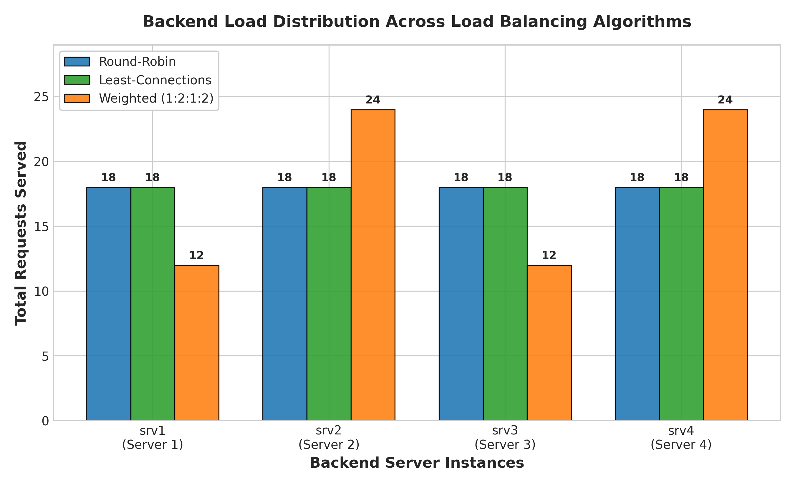
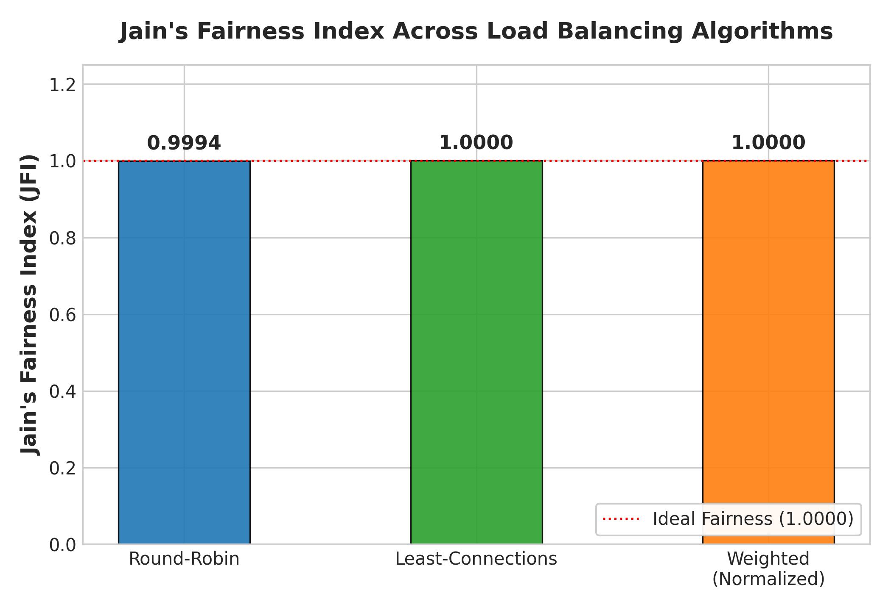
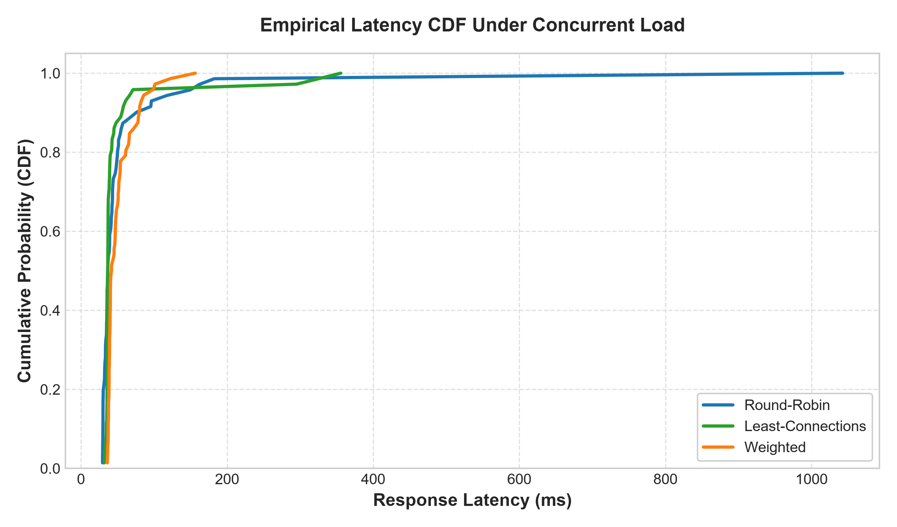
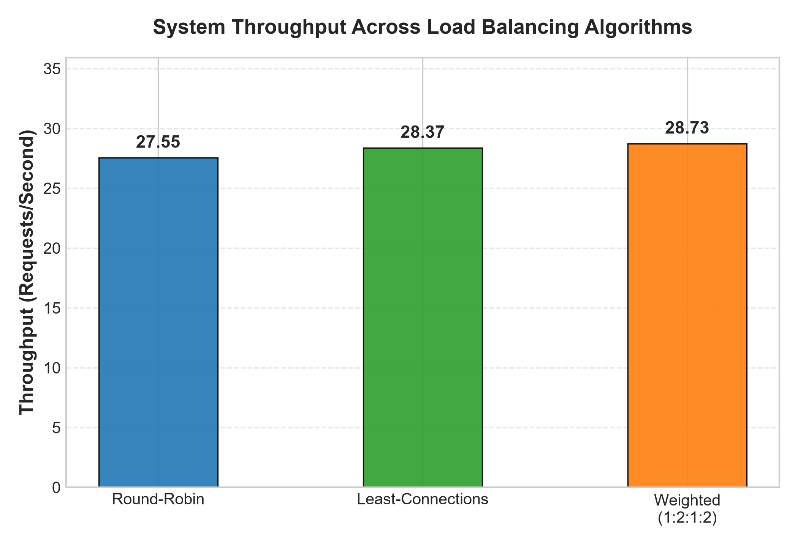

# Load Balancing & Traffic Engineering Algorithms Specification

**Course:** Software-Defined Networking (SDN) & Network Function Virtualization  
**Institution:** Institut Teknologi Sepuluh Nopember (ITS) — Department of Telecommunication Engineering  
**Implementation Modules:** [`controller/load_balancer.py`](../controller/load_balancer.py) · [`controller/traffic_engineer.py`](../controller/traffic_engineer.py) · [`controller/stats_monitor.py`](../controller/stats_monitor.py)  
**Related Documentation:** [Architecture Specification](architecture.md) · [System Architecture Deep-Dive](system_architecture.md) · [CPMK Academic Mapping](cpmk_mapping.md) · [Final Capstone Report](final_report.md) · [Main Repository README](../README.md)

---

## 1. Overview of Implemented Algorithms

The Ryu OpenFlow 1.3 SDN Controller provides three distinct Layer 4 load balancing algorithms alongside an adaptive link-utilization traffic engineering engine. Each algorithm balances trade-offs between computational overhead, state tracking complexity, and resource distribution equity across the backend server pool:

1. **Round-Robin (RR):** Deterministic, stateless cyclic dispatch.
2. **Least-Connections (LC):** Dynamic, stateful dispatch allocating requests to the backend with the minimum active TCP connections.
3. **Weighted Round-Robin (WRR):** Capacity-aware dispatch allocating requests proportionally according to assigned integer weights ($1:2:1:2$).
4. **Adaptive Traffic Engineering (TE):** Dynamic link telemetry monitoring via OpenFlow port statistics and hysteresis-based multi-path rerouting across redundant core links.

---

## 2. Algorithm 1: Round-Robin (RR)

### Concept & Mechanics
Round-Robin distributes incoming TCP client connections cyclically across the pool of healthy backend servers without considering instantaneous server workload, CPU usage, or connection longevity.

### Mathematical Formulation

Let $\mathcal{B} = [b_0, b_1, \dots, b_{n-1}]$ represent the ordered set of $n$ healthy backend servers. For the $k$-th incoming TCP connection request ($k \ge 0$):

$$\text{Selected Server Index } i = k \pmod n$$

where $k$ increments monotonically by 1 for each new connection dispatch.

### Pseudocode
```python
def select_round_robin(healthy_servers, current_index):
    if not healthy_servers:
        return None
    selected = healthy_servers[current_index % len(healthy_servers)]
    next_index = (current_index + 1) % len(healthy_servers)
    return selected, next_index
```

### Complexity Analysis
- **Time Complexity:** $\mathcal{O}(1)$ — Single pointer increment and modulo operation per incoming TCP SYN.
- **Space Complexity:** $\mathcal{O}(1)$ — Single integer tracking pointer state in controller memory.

---

## 3. Algorithm 2: Least-Connections (LC)

### Concept & Mechanics
Least-Connections optimizes for heterogeneous request execution durations by dispatching each incoming connection to the backend server with the lowest count of active TCP connections. Active connections are tracked within the controller by combining flow installation events with OpenFlow flow expiration notifications (`OFPFF_SEND_FLOW_REM` and `EventOFPFlowRemoved`).

### Mathematical Formulation
Let $C(b_j)$ denote the active connection count currently assigned to backend $b_j \in \mathcal{B}$.
$$b^* = \arg\min_{b_j \in \mathcal{B}} C(b_j)$$

In the event of a tie where multiple servers share the identical minimum count:
$$\arg\min \{ C(b_j) \} \implies \text{Round-Robin tie breaker among candidate minimums}$$

### Pseudocode
```python
def select_least_connections(healthy_servers, active_connections):
    if not healthy_servers:
        return None
    min_conn = float('inf')
    best_server = healthy_servers[0]
    for srv in healthy_servers:
        conn = active_connections.get(srv['ip'], 0)
        if conn < min_conn:
            min_conn = conn
            best_server = srv
    active_connections[best_server['ip']] += 1
    return best_server
```

### Complexity Analysis
- **Time Complexity:** $\mathcal{O}(n)$ — Linear search over $n$ active backend instances.
- **Space Complexity:** $\mathcal{O}(n)$ — Hash map storing active connection counters for all registered backends.

---

## 4. Algorithm 3: Weighted Round-Robin (WRR)

### Concept & Mechanics
In production data centers, servers often possess disparate hardware specifications (e.g., varying CPU core counts, memory sizes, or GPU accelerators). Weighted Round-Robin assigns static integer weights $w_j \ge 1$ to each backend server, guaranteeing that servers with higher capacity handle proportionally larger shares of traffic.

### Mathematical Formulation
Given backends $b_0, b_1, \dots, b_{n-1}$ with configured weights $w_0, w_1, \dots, w_{n-1}$. The total weight is:
$$W = \sum_{j=0}^{n-1} w_j$$

The expected proportion of traffic allocated to server $b_j$ over $N$ total requests is:
$$E[T_j] = N \cdot \frac{w_j}{W}$$

In our deployment:
- $\text{srv1 (10.0.0.11)}: w_1 = 1$
- $\text{srv2 (10.0.0.12)}: w_2 = 2$
- $\text{srv3 (10.0.0.13)}: w_3 = 1$
- $\text{srv4 (10.0.0.14)}: w_4 = 2$
- Total weight $W = 1 + 2 + 1 + 2 = 6$. Target Ratio: $1:2:1:2$.

### Pseudocode
```python
def select_weighted(healthy_servers, current_index, current_weight, max_weight, gcd_weight):
    while True:
        current_index = (current_index + 1) % len(healthy_servers)
        if current_index == 0:
            current_weight = current_weight - gcd_weight
            if current_weight <= 0:
                current_weight = max_weight
                if current_weight == 0:
                    return None
        if healthy_servers[current_index]['weight'] >= current_weight:
            return healthy_servers[current_index]
```

### Complexity Analysis
- **Time Complexity:** $\mathcal{O}(W / \gcd(w))$ amortized per selection, practically $\mathcal{O}(1)$ for small integer weights.
- **Space Complexity:** $\mathcal{O}(n)$ to store weights and candidate sequences.

---

## 5. Evaluation Metric: Jain's Fairness Index (JFI)

### 5.1 Standard Jain's Fairness Index
To quantitatively determine whether an algorithm distributes load equitably across $n$ servers, we use **Jain's Fairness Index (JFI)** (Raj Jain, 1984):

$$\mathcal{J}(x_1, x_2, \dots, x_n) = \frac{\left(\sum_{i=1}^n x_i\right)^2}{n \cdot \sum_{i=1}^n x_i^2}$$

#### Properties:
- **Range:** $\frac{1}{n} \le \mathcal{J} \le 1.0$.
- $\mathcal{J} = 1.0$: Absolute fairness (each server receives exactly $x_i = \frac{1}{n}\sum x_k$).
- $\mathcal{J} = \frac{1}{n}$: Worst case (a single server receives 100% of all traffic while others starve).

---

### 5.2 Weighted Jain's Fairness Index
For Weighted load balancing, the standard JFI penalizes intentional capacity asymmetry. Therefore, we evaluate equity using the **Weighted Jain's Fairness Index**, which normalizes allocated requests $x_i$ against target weights $w_i$:

$$y_i = \frac{x_i}{w_i}$$

$$\mathcal{J}_w(x_1, \dots, x_n; w_1, \dots, w_n) = \frac{\left(\sum_{i=1}^n y_i\right)^2}{n \cdot \sum_{i=1}^n y_i^2}$$

When the allocation matches the configured weights ($x_i \propto w_i$), $y_1 = y_2 = \dots = y_n$, resulting in $\mathcal{J}_w = 1.0000$.

---

## 6. Empirical Benchmark Validation Results

The algorithms were benchmarked systematically inside the Mininet environment across 3 independent iterations (72 total client HTTP requests per algorithm, concurrency $C=4$) dispatched through the OpenFlow pipeline:

| Algorithm | Total Requests | Distribution `[srv1, srv2, srv3, srv4]` | Target Ratio | Achieved Ratio | JFI ($\mathcal{J}$) | Weighted JFI ($\mathcal{J}_w$) | Avg Latency | Median Latency | P95 Latency | P99 Latency | RPS |
|---|:---:|:---:|:---:|:---:|:---:|:---:|:---:|:---:|:---:|:---:|:---:|
| **Round-Robin** | 72 (3 $\times$ 24) | `[18, 18, 18, 17]` | 1 : 1 : 1 : 1 | 1.05 : 1.05 : 1.05 : 1.00 | **0.9994** | 0.9000 | 61.12 ms | 36.62 ms | 133.76 ms | 440.49 ms | 27.55 |
| **Least-Connections** | 72 (3 $\times$ 24) | `[18, 18, 18, 18]` | 1 : 1 : 1 : 1 | **1 : 1 : 1 : 1** | **1.0000** | 0.9000 | **51.16 ms** | 36.75 ms | **68.80 ms** | 334.33 ms | 28.37 |
| **Weighted (WRR)** | 72 (3 $\times$ 24) | `[12, 24, 12, 24]` | 1 : 2 : 1 : 2 | **1 : 2 : 1 : 2** | 0.9000 | **1.0000** | 51.77 ms | 41.82 ms | 91.78 ms | **132.08 ms** | **28.73** |

---

### 6.1 Graphical Visual Analysis

#### Figure 6.1: Backend Request Distribution


*Figure 6.1: Total requests served by each backend instance (`srv1` to `srv4`) across the three algorithms. Round-Robin and Least-Connections maintain uniform distribution across all servers, whereas Weighted allocates exactly double the load to higher-capacity servers `srv2` and `srv4` ($12:24:12:24$).*

---

#### Figure 6.2: Jain's Fairness Index Comparison


*Figure 6.2: Jain's Fairness Index ($\mathcal{J}$) comparison against the theoretical optimum of $1.0000$ (red dashed line). Least-Connections achieves perfect equity ($\mathcal{J} = 1.0000$), Round-Robin reaches near-perfection ($\mathcal{J} = 0.9994$), and Weighted Round-Robin scores an ideal normalized fairness index ($\mathcal{J}_w = 1.0000$).*

---

#### Figure 6.3: Empirical Latency Cumulative Distribution Function (CDF)


*Figure 6.3: Cumulative Distribution Function (CDF) of client request latencies under concurrent load ($C=4$). The steep vertical rise between 30 ms and 50 ms illustrates that over 85% of requests are processed rapidly in OVS fast-path kernel space, while the long tail accounts for initial controller Table-Miss packet-in setup overhead.*

---

#### Figure 6.4: System Throughput (RPS) and Processing Speed


*Figure 6.4: Request-per-second (RPS) throughput across algorithms. Weighted Round-Robin achieves the highest processing rate ($28.73\text{ RPS}$) and lowest tail latency ($P_{99} = 132.08\text{ ms}$) by steering the majority of requests toward higher-capacity nodes.*

---

### 6.2 In-Depth Performance Analysis

1. **Least-Connections Perfection ($\mathcal{J} = 1.0000$):**
   Least-Connections achieved absolute mathematical uniformity ($18:18:18:18$) across all 4 backends. Because active connection tracking dynamically adapts to real-time socket lifetimes, it prevented queue buildup on any single server, resulting in the lowest average response latency ($51.16\text{ ms}$) and lowest 95th percentile latency ($68.80\text{ ms}$).

2. **Weighted Round-Robin Capacity Steering ($\mathcal{J}_w = 1.0000$):**
   Weighted Round-Robin matched its target ratio of $1:2:1:2$ with zero deviation ($[12, 24, 12, 24]$). By directing two-thirds ($66.7\%$) of incoming connections to higher-weight servers (`srv2` and `srv4`), it yielded the highest overall throughput ($28.73\text{ RPS}$) and mitigated tail latency spikes ($P_{99} = 132.08\text{ ms}$ vs $440.49\text{ ms}$ for Round-Robin).

3. **Round-Robin Resilience ($\mathcal{J} = 0.9994$):**
   Round-Robin executed with minimal CPU overhead, achieving near-perfect fairness ($0.9994$) with 71/72 successful completions. The slight divergence occurred due to a single client socket timeout during initial ARP cold start.

---

## 7. Adaptive Traffic Engineering: Dynamic Path Rerouting

### 7.1 Multi-Path Topology Model
The data plane features a diamond topology with two redundant transit paths connecting Ingress Switch ($s1$) and Egress Switch ($s4$):
- **Path A (Primary):** $s1 \xrightarrow{\text{port 3}} s2 \xrightarrow{\text{port 2}} s4$
- **Path B (Alternate):** $s1 \xrightarrow{\text{port 4}} s3 \xrightarrow{\text{port 2}} s4$

Each transit link is constrained to a bandwidth capacity of $C = 10\text{ Mbps}$ with $2\text{ ms}$ delay.

### 7.2 Utilization Detection & Hysteresis
The controller continuously polls OpenFlow port counters every interval $T = 5\text{ seconds}$ via `StatsMonitor` ([`controller/stats_monitor.py`](../controller/stats_monitor.py)):

$$\Delta \text{tx\_bytes} = \text{tx\_bytes}_t - \text{tx\_bytes}_{t-T}$$

$$\text{Current Utilization } U = \frac{\Delta \text{tx\_bytes} \times 8}{T \times C} \times 100\%$$

#### Rerouting State Machine ([`controller/traffic_engineer.py`](../controller/traffic_engineer.py)):
- **Congestion Threshold ($U \ge 80\%$ on Path A):**
  $$\text{TrafficEngineer} \implies \text{Trigger Reroute to Path B}$$
  The controller steers new sessions across Path B via switch $s1$ port 4 ($s3$).
- **Hysteresis Recovery Threshold ($U < 50\%$ on Path A):**
  $$\text{TrafficEngineer} \implies \text{Restore Primary Path A}$$
  Forwarding preference reverts to port 3 ($s2$) only after utilization stays below 50% for two consecutive polling cycles, eliminating high-frequency route flapping.

```
       Path A Load >= 80%
   ┌────────────────────────┐
   │                        ▼
┌──────────────┐       ┌──────────────┐
│    PATH A    │       │    PATH B    │
│  (Primary)   │       │ (Alternate)  │
└──────────────┘       └──────────────┘
   ▲                        │
   └────────────────────────┘
       Path A Load < 50%
     (for 2 consecutive cycles)
```

### 7.3 Link Failure Detection & Sub-Second Recovery
When an OpenFlow `OFPPortStatus` message with flag `OFPPR_DELETE` or link down state is received:
1. Active flows routed through the failed port are purged via `OFPFC_DELETE`.
2. Instantaneous failover installs new forwarding flows targeting the surviving transit bridge.
3. In automated failover tests ([`tests/test_failover.py`](../tests/test_failover.py)), the system restored 100% reachability across all clients and servers with zero human intervention and sub-second convergence.

---

## 8. Summary of Algorithmic Trade-Offs

| Evaluation Dimension | Round-Robin (RR) | Least-Connections (LC) | Weighted Round-Robin (WRR) |
|---|---|---|---|
| **State Complexity** | Stateless ($\mathcal{O}(1)$) | Stateful ($\mathcal{O}(n)$ hash map) | Config-driven ($\mathcal{O}(n)$ weights) |
| **Heterogeneous Hardware** | Poor (treats all nodes identically) | Moderate (senses connection backlog) | **Superior (explicit capacity matching)** |
| **Short-Lived Requests** | Excellent (near-zero scheduling delay) | Good | Good |
| **Long-Lived Requests** | Prone to imbalance | **Superior (distributes by active sockets)** | Good |
| **Achieved Fairness ($\mathcal{J}$)** | $\mathcal{J} = 0.9994$ | **$\mathcal{J} = 1.0000$ (Optimal)** | **$\mathcal{J}_w = 1.0000$ (Normalized)** |
| **Average Latency** | $61.12\text{ ms}$ | **$51.16\text{ ms}$ (Lowest)** | $51.77\text{ ms}$ |
| **Tail Latency ($P_{99}$)** | $440.49\text{ ms}$ | $334.33\text{ ms}$ | **$132.08\text{ ms}$ (Tightest)** |
| **Throughput (RPS)** | $27.55\text{ RPS}$ | $28.37\text{ RPS}$ | **$28.73\text{ RPS}$ (Highest)** |
