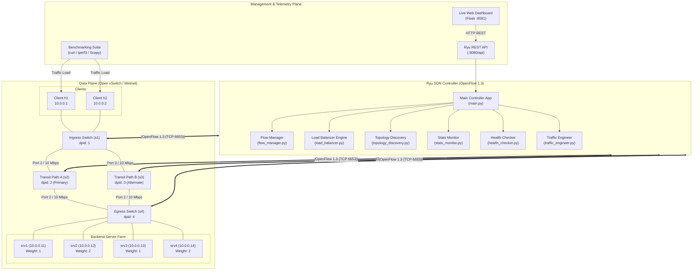
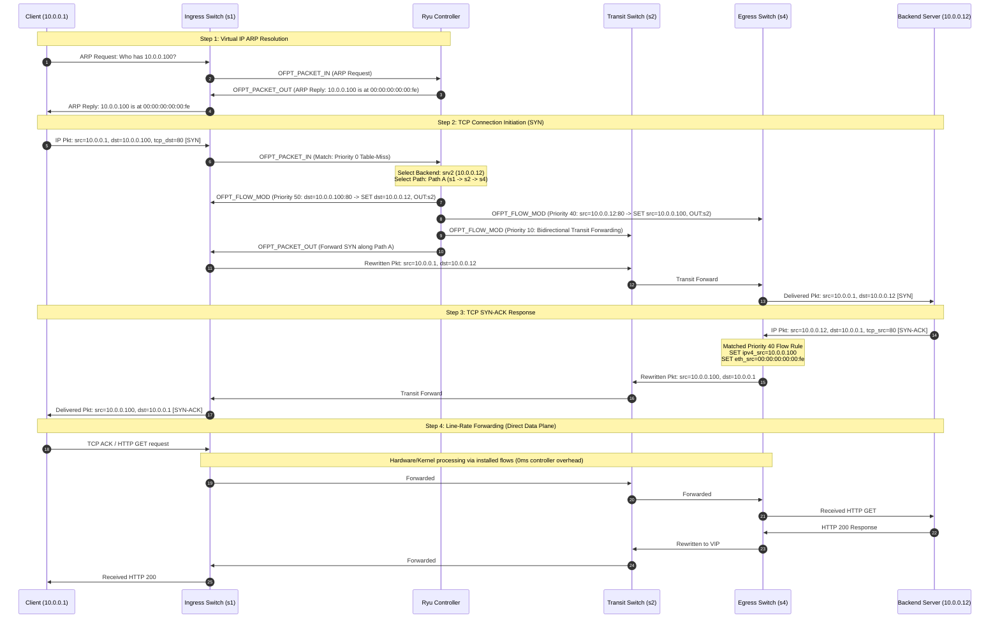

# System Architecture Specification

## OpenFlow 1.3 SDN-Based Load Balancer & Adaptive Traffic Engineering System

---

## 1. Architectural Overview

This system replaces traditional hardware application delivery controllers (ADCs) by decoupling control and data planes through OpenFlow 1.3. The control plane, implemented using the **Ryu SDN Framework**, manages physical forwarding topology, dynamic load balancing, health monitoring, and traffic engineering. The data plane is executed on **Open vSwitch (OVS)** inside a Mininet-emulated network environment.

---

## 2. Decoupling the Control and Data Planes

Traditional load balancers (e.g., F5 BIG-IP, Citrix ADC) combine packet inspection, state tracking, and packet rewriting into proprietary hardware appliances. This project achieves complete separation:

1. **Data Plane (Open vSwitch):**
   - High-throughput flow processing without connection state machines.
   - Executes OpenFlow 1.3 actions: `SET_FIELD` (`ipv4_dst`, `eth_dst`, `ipv4_src`, `eth_src`), `OUTPUT`, `DROP`.
   - Forwarding state is governed strictly by the flow tables programmed by Ryu.
   - Operates in secure mode (`fail_mode=secure`), ensuring switches drop or buffer unhandled packets rather than falling back to traditional legacy flooding.

2. **Control Plane (Ryu Controller):**
   - Centralized intelligence running on Python 3.
   - Dynamic server selection algorithms (Round-Robin, Least-Connections, Weighted).
   - Link telemetry collection via asynchronous OpenFlow multi-part stats (`OFPPortStatsRequest`).
   - Active Layer 7 application health verification via periodic HTTP probing.
   - Dynamic path recomputation and proactive flow installation during link saturation or failures.

3. **Southbound Protocol (OpenFlow 1.3):**
   - Standardized binary wire protocol operating over TCP port 6653.
   - Message types utilized:
     - `OFPT_HELLO`: Protocol version negotiation (OpenFlow 1.3, `0x04`).
     - `OFPT_FEATURES_REQUEST` / `OFPT_FEATURES_REPLY`: Switch datapath capabilities exchange.
     - `OFPT_FLOW_MOD`: Proactive and reactive flow table installations, modifications, and removals.
     - `OFPT_PACKET_IN`: Data plane miss redirection to controller logic.
     - `OFPT_PACKET_OUT`: Controller-generated packets injected into the data plane (e.g., Proxy ARP).
     - `OFPT_MULTIPART_REQUEST` / `REPLY`: Statistics telemetry polling (Port and Flow statistics).
     - `OFPT_PORT_STATUS`: Asynchronous link status updates (e.g., interface down/up detection).

---

## 3. OpenFlow Flow Table Pipeline & Priority Hierarchy

To avoid packet ambiguity and race conditions, the single-table and multi-pipeline flow matches adhere to an explicit priority hierarchy:

| Priority | Purpose | Match Conditions | Actions | Timeouts |
|---|---|---|---|---|
| **100** | Health Check & Management Bypass | `eth_type=0x0800, ip_proto=6, tcp_dst=80, ipv4_dst={10.0.0.11-14}` | `OUTPUT:port` (Direct forwarding without NAT translation) | `idle=0, hard=0` |
| **50** | Forward VIP NAT (Client $\rightarrow$ Server) | `eth_type=0x0800, ip_proto=6, ipv4_src=client_ip, ipv4_dst=10.0.0.100, tcp_dst=80` | `SET_FIELD(ipv4_dst=srv_ip)`, `SET_FIELD(eth_dst=srv_mac)`, `OUTPUT:transit_port` | `idle=15, hard=60` |
| **40** | Reverse VIP NAT (Server $\rightarrow$ Client) | `eth_type=0x0800, ip_proto=6, ipv4_src=srv_ip, ipv4_dst=client_ip, tcp_src=80` | `SET_FIELD(ipv4_src=10.0.0.100)`, `SET_FIELD(eth_src=vip_mac)`, `OUTPUT:client_port` | `idle=15, hard=60` |
| **30** | Proxy ARP Handling | `eth_type=0x0806, arp_tpa=10.0.0.100` | Controller Packet-In / Direct Controller ARP Reply | `idle=0, hard=0` |
| **20** | Traffic Engineering Rerouting | Link-specific forwarding rules | Forward to alternate path (Path B instead of Path A) | `idle=30, hard=120` |
| **10** | Standard Unicast L2/L3 Forwarding | `eth_dst=host_mac` | `OUTPUT:host_port` | `idle=30, hard=60` |
| **0** | Default Table-Miss | `match=*` | `OUTPUT:OFPP_CONTROLLER` (Buffer: `OFPCML_NO_BUFFER`) | Permanent |

---

## 4. End-to-End Packet Walkthrough: Bidirectional NAT Rewriting

---

## 5. Resilience & High-Availability Architecture

1. **Active Probing (`HealthChecker`):**
   - Continuously performs non-blocking HTTP health checks to each backend instance (`/health`).
   - If an instance fails consecutive checks (configured limit: 2 failures), the controller removes the node from active load balancing scheduling.
   - Any active flows targeting the failed node are proactively deleted via `OFPFC_DELETE` to trigger immediate re-selection on subsequent packets.
   - When the backend recovers (1 successful response), it is restored to the pool automatically.

2. **Adaptive Traffic Engineering (`TrafficEngineer`):**
   - Periodically queries switch port stats (`OFPPortStatsRequest`).
   - Computes delta transmit/receive bytes over polling interval $\Delta t$:
     $$\text{Throughput (bps)} = \frac{(B_t - B_{t-\Delta t}) \times 8}{\Delta t}$$
     $$\text{Utilization (\%)} = \frac{\text{Throughput}}{\text{Link Capacity (10 Mbps)}} \times 100$$
   - When the primary transit path ($s1 \leftrightarrow s2 \leftrightarrow s4$) exceeds 75% link capacity, the controller redirects new and elephant flows across the alternate path ($s1 \leftrightarrow s3 \leftrightarrow s4$).
