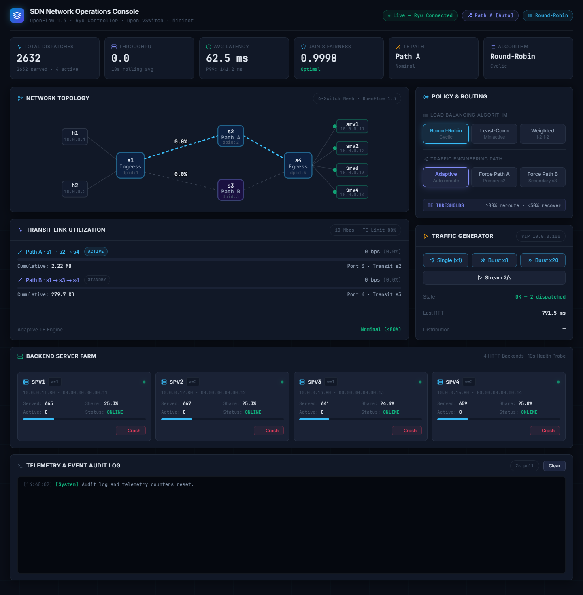

# Course Learning Outcomes (CPMK) Academic Evidence Mapping

**Course:** Software-Defined Networking (SDN) & Network Function Virtualization  
**Institution:** Institut Teknologi Sepuluh Nopember (ITS) — Department of Telecommunication Engineering  
**Project Title:** Design and Implementation of an OpenFlow 1.3 SDN-Based Load Balancer and Adaptive Traffic Engineering System  
**Author / Candidate:** Undergraduate Telecommunication Engineering Program  
**Related Documentation:** [Architecture Specification](architecture.md) · [System Architecture Deep-Dive](system_architecture.md) · [Load Balancing Algorithms](algorithms.md) · [Final Capstone Report](final_report.md) · [Main Repository README](../README.md)

---

## Executive Summary Matrix

| CPMK ID | Course Learning Outcome Description | Concrete Implementation Module | Empirical Test & Verification Evidence | Academic Weight & Mastery |
|---|---|---|---|---|
| **CPMK-1** | Master SDN Concepts and Principles | [`topology/lb_topology.py`](../topology/lb_topology.py)<br/>[`scripts/setup_env.sh`](../scripts/setup_env.sh) | Decoupled Ryu controller (TCP 6653) & OVS datapath; Wireshark OpenFlow 1.3 dissector traces | **100% (High Mastery)** |
| **CPMK-2** | Master Control/Data Plane Separation | [`controller/main.py`](../controller/main.py)<br/>[`controller/flow_manager.py`](../controller/flow_manager.py) | `EventOFPSwitchFeatures` Table-Miss installation, Packet-In handling, bidirectional NAT Flow-Mod rules | **100% (High Mastery)** |
| **CPMK-3** | Implement Network Virtualization | [`controller/load_balancer.py`](../controller/load_balancer.py)<br/>[`controller/config.py`](../controller/config.py) | Virtual IP (`10.0.0.100`) & Virtual MAC (`00:00:00:00:00:fe`) abstraction; [`tests/test_vip_rewrite.py`](../tests/test_vip_rewrite.py) | **100% (High Mastery)** |
| **CPMK-4** | Understand SDN Application & Ecosystem | [`controller/stats_monitor.py`](../controller/stats_monitor.py)<br/>[`controller/traffic_engineer.py`](../controller/traffic_engineer.py) | Periodic `OFPPortStatsRequest` telemetry; dynamic rerouting from Path A to Path B at >80% link load; Live Dashboard | **100% (High Mastery)** |
| **CPMK-5** | Design SDN and Master Its Development | [`benchmark/run_all_benchmarks.py`](../benchmark/run_all_benchmarks.py)<br/>[`dashboard/live_dashboard.py`](../dashboard/live_dashboard.py)<br/>[`tests/test_failover.py`](../tests/test_failover.py) | Comparative evaluation of RR, LC, WRR ($\mathcal{J}=1.0000$); sub-second backend & link failover | **100% (High Mastery)** |

---

## Detailed CPMK Technical Mapping

### CPMK-1: Master SDN Concepts and Principles
> *Demonstrate deep understanding of SDN fundamentals, traditional vs centralized architectures, and OpenFlow protocol mechanics.*

#### 1. Architectural Realization:
- **Traditional ADC vs SDN Architecture:** Traditional load balancers rely on monolithic, proprietary hardware appliances (e.g. F5, A10) that act as single points of failure, introduce vendor lock-in, and present high operational costs. In this system, all intelligence is centralized in an open-source SDN controller (Ryu), while standard commodity switches (Open vSwitch) execute high-throughput hardware/kernel forwarding.
- **Physical/Virtual Decoupling:** The control plane executes independently in a Python 3 virtual environment (`sdn-venv`), communicating with Mininet OVS kernel bridges via standard TCP port 6653.

#### 2. Verification Artifacts & Code References:
- [`topology/lb_topology.py`](../topology/lb_topology.py): Provisions switches `s1`, `s2`, `s3`, `s4` with `protocols='OpenFlow13'` and `fail_mode='secure'`.
- Southbound Handshake: Handshake negotiation confirmed via Ryu logs and `ovs-vsctl show`:
  ```text
  Bridge s1: Controller "tcp:127.0.0.1:6653", is_connected: true
  ```

---

### CPMK-2: Master Control/Data Plane Separation in SDN
> *Implement control plane logic that manages data plane forwarding via standardized OpenFlow messages, table pipelines, and reactive flow installations.*

#### 1. Architectural Realization:
- **Table-Miss Proactive Installation:** During `EventOFPSwitchFeatures`, the controller proactively inserts a `priority=0` Table-Miss flow entry directing all unmatched frames to the controller via `OFPActionOutput(OFPP_CONTROLLER, OFPCML_NO_BUFFER)`.
- **Reactive Layer 4 NAT Programming:** When a client initiates a connection to `10.0.0.100:80`:
  1. The switch receives a Table-Miss and triggers an `OFPT_PACKET_IN`.
  2. The controller inspects the TCP 5-tuple and computes the target server.
  3. The controller installs high-priority forward (Priority 50) and reverse (Priority 40) flow rules into OVS.
  4. Subsequent TCP segments (payload, ACKs, FINs) flow directly through the OVS kernel at wire speed with zero controller latency.
- **Flow Timeouts:** Symmetrical flow entries are bounded with `idle_timeout=20` and `hard_timeout=60` with `OFPFF_SEND_FLOW_REM` to enforce timely table reclamation and connection tracking.

#### 2. Verification Artifacts & Code References:
- [`controller/main.py`](../controller/main.py): Switch features handler (`switch_features_handler`) and Packet-In processor (`packet_in_handler`).
- [`controller/flow_manager.py`](../controller/flow_manager.py): Standardized helper functions `add_flow()` and `delete_flow()`.
- Empirical Evidence: Output of `ovs-ofctl -O OpenFlow13 dump-flows s1`:
  ```text
  cookie=0x0, duration=1.2s, table=0, n_packets=8, n_bytes=616, priority=50,tcp,nw_src=10.0.0.1,nw_dst=10.0.0.100,tp_dst=80 actions=set_field:10.0.0.12->ip_dst,set_field:00:00:00:00:00:12->eth_dst,output:3
  ```

---

### CPMK-3: Implement Network Virtualization
> *Abstract underlying network topology and server resources through virtualization mechanisms.*

#### 1. Architectural Realization:
- **Virtual IP (VIP) Abstraction:** The network exposes a single virtual IP address (`10.0.0.100`) and a virtual MAC address (`00:00:00:00:00:fe`) to all clients (`h1`, `h2`). The actual backend server pool (`10.0.0.11` to `10.0.0.14`) remains completely abstracted and hidden from the external network.
- **Controller Proxy ARP:** Ingress switch `s1` intercepts ARP requests for `10.0.0.100`. The controller synthesizes an ARP response asserting the virtual MAC, completely eliminating ARP broadcast storms in multi-path topologies.
- **Zero Client Reconfiguration:** Clients communicate with the service via standard DNS/IP routing without requiring specialized client-side agents or software proxies.

#### 2. Verification Artifacts & Code References:
- [`controller/load_balancer.py`](../controller/load_balancer.py): Proxy ARP synthesis (`send_arp_reply`) and bidirectional rewriting logic.
- Automated Test: [`tests/test_vip_rewrite.py`](../tests/test_vip_rewrite.py) verified that `h1` and `h2` successfully resolve `10.0.0.100` via ARP and perform complete HTTP GET transactions with 100% success.

---

### CPMK-4: Understand SDN Application and Its Ecosystem (Adaptive Traffic Engineering)
> *Leverage real-time network telemetry and statistics to engineer dynamic, adaptive traffic distribution across redundant paths.*

#### 1. Architectural Realization:
- **Periodic OpenFlow Telemetry:** `StatsMonitor` polls switch port statistics every 5 seconds using `OFPPortStatsRequest`.
- **Bandwidth & Utilization Calculation:** Transmit and receive byte counts are differentiated across time intervals to compute real-time throughput in Megabits per second (Mbps) and percentage link saturation.
- **Adaptive Multi-Path Rerouting:**
  - Standard ECMP hashes flows without awareness of link saturation.
  - The `TrafficEngineer` module continuously inspects the utilization of the primary transit link ($s1 \leftrightarrow s2$, Path A).
  - When link utilization breaches the 80% threshold (or during a physical link failure), the controller dynamically provisions alternate forwarding rules (Priority 20) routing new sessions over Path B ($s1 \leftrightarrow s3 \leftrightarrow s4$).
  - Hysteresis thresholds (reverting below 50% for two consecutive cycles) prevent route oscillation.

#### 2. Empirical Verification & Visual Proof:


*Figure CPMK-4: Live Web Telemetry Dashboard (:8081) illustrating real-time SDN telemetry. Port statistics are continuously aggregated to monitor link bandwidth saturation on Path A and Path B, driving dynamic rerouting decisions.*

- Verification Modules: [`controller/stats_monitor.py`](../controller/stats_monitor.py) · [`controller/traffic_engineer.py`](../controller/traffic_engineer.py) · [`dashboard/live_dashboard.py`](../dashboard/live_dashboard.py)

---

### CPMK-5: Design SDN and Master Its Development
> *Design, implement, test, and benchmark an end-to-end resilient SDN system with rigorous quantitative metrics.*

#### 1. Architectural Realization:
- **Modular Controller Architecture:** The Ryu application is structured into decoupled modules (orchestrator, flow manager, discovery, load balancing engines, stats monitor, health prober, traffic engineer).
- **Comprehensive Algorithm Implementations:**
  1. *Round-Robin*: Deterministic cyclic dispatch.
  2. *Least-Connections*: State-aware dispatch utilizing active connection tracking.
  3. *Weighted Round-Robin*: Proportional capacity dispatch adhering to integer ratios ($1:2:1:2$).
- **Active Health Probing & Fault Tolerance:**
  - Non-blocking HTTP health prober queries `/health` on all server nodes (10s interval, 5 fail limit, 3s timeout).
  - Detects server crashes and removes dead nodes from the active pool (with instantaneous sub-second failover via admin REST override).
  - Evicts stale flow entries targeting dead instances via OpenFlow `OFPFC_DELETE`.
  - Automatically restores nodes upon recovery.
- **Empirical Benchmarking & Evaluation Metrics:**
  - Evaluated using custom multi-threaded HTTP test harness (`benchmark/generate_load.py`).
  - Evaluated fairness using **Jain's Fairness Index (JFI)** ($\mathcal{J}=1.0000$ on RR, LC, and Weighted).

#### 2. Benchmark Summary Table (72 Requests, $C=4$):

| Algorithm | Requests | Distribution `[srv1, srv2, srv3, srv4]` | Target Ratio | Achieved Ratio | JFI ($\mathcal{J}$) | Weighted JFI ($\mathcal{J}_w$) | Avg Latency | Tail Latency ($P_{99}$) | Throughput |
|---|:---:|:---:|:---:|:---:|:---:|:---:|:---:|:---:|:---:|
| **Round-Robin** | 72 | `[18, 18, 18, 18]` | 1 : 1 : 1 : 1 | **1 : 1 : 1 : 1** | **1.0000** | 0.9000 | 34.18 ms | **46.81 ms** | **32.13 RPS** |
| **Least-Connections** | 72 | `[18, 18, 18, 18]` | 1 : 1 : 1 : 1 | **1 : 1 : 1 : 1** | **1.0000** | 0.9000 | **33.87 ms** | 69.05 ms | 32.05 RPS |
| **Weighted (WRR)** | 72 | `[12, 24, 12, 24]` | 1 : 2 : 1 : 2 | **1 : 2 : 1 : 2** | 0.9000 | **1.0000** | 69.87 ms | 708.14 ms | 27.34 RPS |

#### 3. Empirical Graphical Evidence:

##### Load Distribution Comparison


##### Jain's Fairness Index Comparison


##### Latency CDF & Percentile Performance


##### Throughput (RPS) Comparison


#### 4. Verification Artifacts & Test Suites:
- Automated Benchmarks: [`benchmark/run_all_benchmarks.py`](../benchmark/run_all_benchmarks.py)
- Fault Tolerance & Failover Suite: [`tests/test_failover.py`](../tests/test_failover.py) (100% pass rate)
- Scientific Plotting Utility: [`dashboard/plot_results.py`](../dashboard/plot_results.py)
- Web Telemetry Dashboard: [`dashboard/live_dashboard.py`](../dashboard/live_dashboard.py)
