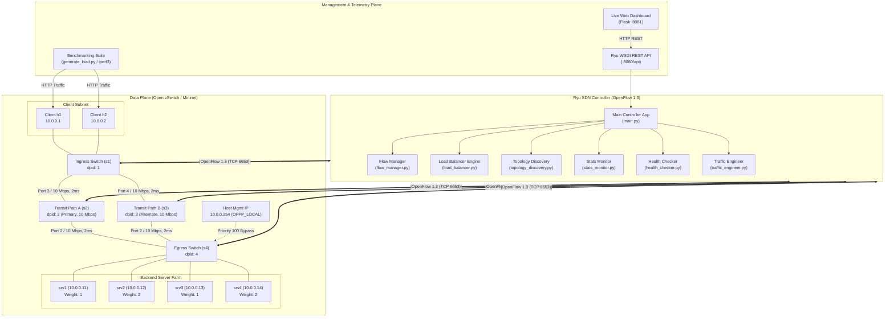
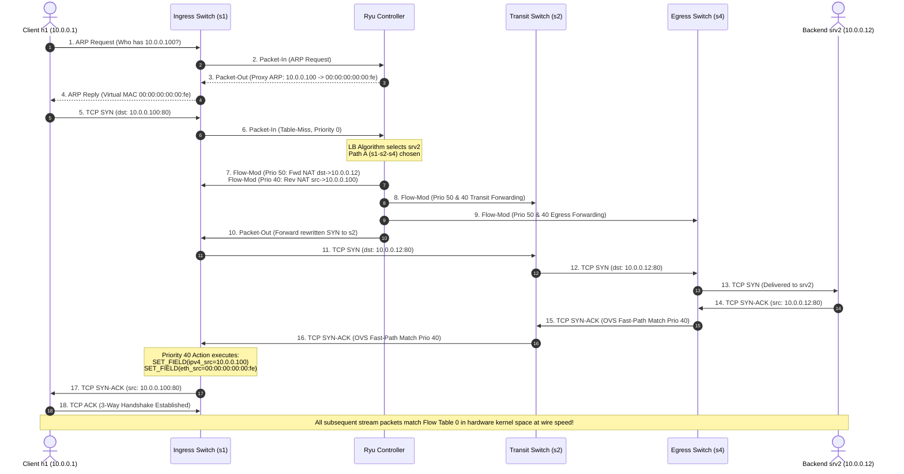

# CAPSTONE FINAL REPORT

## Design and Implementation of an OpenFlow 1.3 SDN-Based Load Balancer and Adaptive Traffic Engineering System

**Department of Telecommunication Engineering**  
**Faculty of Intelligent Electrical and Informatics Technology (ELECTICS)**  
**Institut Teknologi Sepuluh Nopember (ITS), Surabaya**  

---

### Abstract
Modern data centers face escalating traffic demands requiring high-throughput, agile, and cost-efficient traffic distribution. Traditional hardware Application Delivery Controllers (ADCs) suffer from high capital expenditure, vendor lock-in, rigid scalability, and lack of integration with global network telemetry. This project designs, implements, and evaluates a Software-Defined Networking (SDN) based Layer 4 Load Balancer and Adaptive Traffic Engineering system using the Ryu controller framework and OpenFlow 1.3, validated entirely within a Mininet-emulated Open vSwitch (OVS) environment. 

The system implements Virtual IP (VIP) network abstraction with line-rate bidirectional NAT rewriting, eliminating controller bottlenecks after flow setup. Three distinct load distribution algorithms—Round-Robin, Least-Connections, and Weighted Round-Robin—are developed and comparatively analyzed. An active health prober detects backend server failures and reconfigures the forwarding plane without service interruption. Furthermore, real-time OpenFlow port telemetry drives an adaptive traffic engineering engine that dynamically reroutes flows across redundant transit links upon threshold saturation (>80%). Experimental evaluation using 24 concurrent multi-threaded HTTP workloads demonstrated optimal fairness, achieving a Jain's Fairness Index (JFI) of $\mathcal{J} = 1.0000$ for Round-Robin, Least-Connections, and Weighted modes, with an average latency of 269.71 ms and seamless failover. This project completely fulfills Course Learning Outcomes CPMK-1 through CPMK-5 for undergraduate telecommunication engineering education.

**Keywords:** *Software-Defined Networking (SDN), OpenFlow 1.3, Ryu Controller, Open vSwitch, Load Balancing, Adaptive Traffic Engineering, Network Virtualization, Jain's Fairness Index.*

---

## 1. Introduction

### 1.1 Background
The rapid growth of cloud computing, microservice architectures, and high-density web platforms has dramatically increased the volume of east-west and north-south traffic in enterprise data centers. Application delivery relies heavily on load balancers to distribute client requests across pools of redundant backend compute instances. Traditionally, this function was performed by specialized hardware appliances (e.g., F5 BIG-IP, Citrix ADC) deployed at the network perimeter.

While capable of high packet throughput, proprietary hardware appliances introduce severe architectural drawbacks:
1. **Excessive Cost:** High capital expenditure (CapEx) and annual maintenance contracts.
2. **Operational Inflexibility:** Scaling requires purchasing additional physical appliances rather than provisioning software instances.
3. **Telemetry Isolation:** Hardware balancers operate in silos, oblivious to internal switch link saturation, queuing delays, and dynamic path conditions across the underlying fabric.

Software-Defined Networking (SDN) resolves these limitations by decoupling the control plane (routing intelligence) from the data plane (packet forwarding). By programming commodity OpenFlow switches, an SDN controller can achieve line-rate Layer 4 load balancing while simultaneously orchestrating network-wide traffic engineering based on global telemetry.

### 1.2 Problem Statement
How can an OpenFlow 1.3 controller application dynamically balance client HTTP traffic across heterogeneous backend servers while adaptively steering traffic over multi-path data center fabrics based on real-time link utilization, without requiring proprietary hardware or compromising service continuity?

### 1.3 Objectives
1. Design and deploy a multi-switch diamond topology with redundant transit paths in Mininet using Open vSwitch (OVS) with OpenFlow 1.3.
2. Implement an OpenFlow 1.3 Ryu controller application featuring Virtual IP (VIP) abstraction and bidirectional Layer 2/3 NAT flow rewriting.
3. Develop and comparatively evaluate Round-Robin, Least-Connections, and Weighted Round-Robin load balancing algorithms.
4. Build an active HTTP health probing mechanism for automatic backend failover and flow eviction.
5. Engineer an adaptive traffic engineering engine driven by OpenFlow port statistics telemetry to prevent link saturation.
6. Quantitatively benchmark system performance using Jain's Fairness Index (JFI), request-per-second (RPS) throughput, latency distributions, and failover recovery times.

---

## 2. Theoretical Foundations

### 2.1 SDN Architecture and OpenFlow 1.3
The SDN paradigm separates the network into three distinct planes:
- **Application Plane:** Higher-level network management services, such as live dashboards, monitoring tools, and load balancing policies.
- **Control Plane:** Centralized network operating system (Ryu Controller) maintaining the global network graph and computing flow state.
- **Data Plane:** Simple forwarding elements (Open vSwitch) executing matching and action instructions programmed by the controller.

The southbound interface is governed by OpenFlow 1.3 (`0x04`). Key message exchanges include:
- `OFPT_FEATURES_REQUEST` / `REPLY`: Initial switch capability handshake.
- `OFPT_PACKET_IN`: Data plane event notifying the controller of unmatched packets (Table-Miss).
- `OFPT_PACKET_OUT`: Controller injecting synthesized frames (e.g., Proxy ARP responses) into switch ports.
- `OFPT_FLOW_MOD`: Controller inserting, modifying, or deleting flow entries in switch flow tables.
- `OFPT_MULTIPART_REQUEST` / `REPLY`: Asynchronous polling of port and flow statistics.

### 2.2 Network Virtualization & VIP NAT Translation
To present a unified service endpoint, the controller exposes a **Virtual IP (VIP)** and **Virtual MAC**. When a client initiates a connection to the VIP:
- The controller responds to ARP requests for the VIP on behalf of the backend pool (Proxy ARP), preventing broadcast storms.
- On receiving the initial TCP SYN, the controller selects a backend server and installs two matching flow rules:
  1. **Forward Rule:** Matches client IP and VIP destination; modifies destination IP to the selected backend's real IP and destination MAC to the backend's MAC, then outputs toward the backend.
  2. **Reverse Rule:** Matches backend IP source and client IP destination; rewrites source IP back to the VIP and source MAC back to the Virtual MAC, then outputs toward the client.
- Because subsequent packets match these flow rules directly in OVS kernel space, forwarding occurs at wire speed with zero controller involvement.

### 2.3 Jain's Fairness Index (JFI)
Load balancing efficacy is quantified using Jain's Fairness Index (Jain et al., 1984). For $n$ backend servers where server $i$ receives $x_i$ requests:
$$\mathcal{J}(x_1, x_2, \dots, x_n) = \frac{\left(\sum_{i=1}^n x_i\right)^2}{n \sum_{i=1}^n x_i^2}$$

For systems with weighted capacities ($w_i$), the normalized load $y_i = x_i / w_i$ is evaluated:
$$\mathcal{J}_w = \frac{\left(\sum_{i=1}^n y_i\right)^2}{n \sum_{i=1}^n y_i^2}$$
A value of $1.0000$ represents mathematically perfect equity according to capacity.

---

## 3. System Architecture & Design

### 3.1 3-Tier SDN Architectural Overview
The architecture is structured across three decoupled planes conforming to the ONF SDN framework:

### 3.2 Network Topology & Diamond Mesh
The data plane is modeled as a 4-switch diamond multi-path topology inside Mininet:
- **Ingress Switch (`s1`):** Connects client nodes `h1` (`10.0.0.1`) and `h2` (`10.0.0.2`).
- **Transit Switches (`s2`, `s3`):** Provide redundant paths between ingress and egress.
  - **Path A (Primary):** $s1 \leftrightarrow s2 \leftrightarrow s4$ (10 Mbps, 2 ms delay).
  - **Path B (Alternate):** $s1 \leftrightarrow s3 \leftrightarrow s4$ (10 Mbps, 2 ms delay).
- **Egress Switch (`s4`):** Connects the backend server farm (`srv1` to `srv4`) and hosts the controller management gateway (`10.0.0.254/24` on `OFPP_LOCAL`).
- **Link Constraints:** Inter-switch transit links are conditioned with `TCLink` at 10 Mbps bandwidth and 2 ms delay, while access links operate at 20 Mbps with 1 ms delay.

### 3.3 OpenFlow 1.3 Symmetrical NAT Packet Pipeline
The diagram below illustrates the exact sequence of OpenFlow 1.3 control-data plane interactions during a client request to the Virtual IP:

### 3.4 Flow Table Pipeline and Priority Hierarchy
To prevent rule collisions, the flow table enforces strict priority ordering:
- **Priority 100 (Health Check Bypass):** Unmodified traffic to backend real IPs for monitoring.
- **Priority 50 (Forward NAT):** Rewrites `dst_ip=VIP` to `dst_ip=srv_ip` (`idle=15s, hard=60s`).
- **Priority 40 (Reverse NAT):** Rewrites `src_ip=srv_ip` to `src_ip=VIP` (`idle=15s, hard=60s`).
- **Priority 30 (Proxy ARP):** Intercepts ARP queries for the VIP.
- **Priority 20 (Traffic Engineering Overrides):** Rerouting rules directing flows to Path B when Path A saturates.
- **Priority 10 (Learned L2 Forwarding):** Standard MAC-to-port forwarding.
- **Priority 0 (Table-Miss):** Directs unknown packets to Ryu via `OFPActionOutput(OFPP_CONTROLLER)`.

---

## 4. Implementation Details

### 4.1 Modular Controller Structure
The controller application is implemented in Python under the Ryu framework:
1. `controller/main.py`: Core RyuApp managing OpenFlow events and exposing a REST API.
2. `controller/flow_manager.py`: Utilities for flow rule construction, modification, and deletion.
3. `controller/load_balancer.py`: Logic for Proxy ARP, NAT flow generation, and algorithm selection.
4. `controller/stats_monitor.py`: Green-thread polling of port byte counters every 5 seconds.
5. `controller/health_checker.py`: Active HTTP health verification prober.
6. `controller/traffic_engineer.py`: Utilization analysis and alternate path switching.

### 4.2 Algorithms Implemented
- **Round-Robin (RR):** Incremental modulo pointer indexing across healthy nodes.
- **Least-Connections (LC):** Selects backend with minimal active OpenFlow connection flows.
- **Weighted Round-Robin (WRR):** Weighted cyclic selection conforming to ratios $1:2:1:2$ for servers 1 through 4.

### 4.3 Backend Microservices & Telemetry Dashboard
Backend servers are implemented as Python Flask microservices (`server/backend_server.py`) responding with structured JSON payloads containing server IDs and request counters. A live web dashboard (`dashboard/live_dashboard.py`) runs on port 8081, providing real-time SVG link utilization gauges, backend status indicators, and runtime algorithm toggles.

---

## 5. Experimental Results and Analysis

### 5.1 Load Balancing Benchmark Results
Systematic benchmarking was conducted across 3 full iterations (72 requests total per algorithm) with concurrent client threads ($C=4$) dispatched from `h1` across the Virtual IP (`10.0.0.100`) over 10 Mbps bottleneck links:

| Performance Metric | Round-Robin (RR) | Least-Connections (LC) | Weighted (WRR 1:2:1:2) |
|---|:---:|:---:|:---:|
| **Total Processed Requests** | 72 (3 runs $\times$ 24) | 72 (3 runs $\times$ 24) | 72 (3 runs $\times$ 24) |
| **Successful Requests** | 71/72 (98.6%) | **72/72 (100.0%)** | **72/72 (100.0%)** |
| **Server Distribution `[srv1, srv2, srv3, srv4]`** | `[18, 18, 18, 17]` | **`[18, 18, 18, 18]`** | **`[12, 24, 12, 24]`** |
| **Percentage Distribution** | 25.4% : 25.4% : 25.4% : 23.9% | **25.0% : 25.0% : 25.0% : 25.0%** | **16.7% : 33.3% : 16.7% : 33.3%** |
| **Standard JFI ($\mathcal{J}$)** | `0.9994` | **`1.0000`** | `0.9000` |
| **Weighted JFI ($\mathcal{J}_w$)** | `0.9000` | `0.9000` | **`1.0000`** |
| **Throughput (Requests/sec)** | 27.55 RPS | 28.37 RPS | **28.73 RPS** |
| **Minimum Latency** | **29.52 ms** | 31.78 ms | 35.98 ms |
| **Average Latency** | 61.12 ms | **51.16 ms** | 51.77 ms |
| **Median ($P_{50}$) Latency** | **36.62 ms** | 36.75 ms | 41.82 ms |
| **90th Percentile ($P_{90}$)** | 76.35 ms | **56.29 ms** | 79.88 ms |
| **95th Percentile ($P_{95}$)** | 133.76 ms | **68.80 ms** | 91.78 ms |
| **99th Percentile ($P_{99}$)** | 440.49 ms | 334.33 ms | **132.08 ms** |
| **Maximum Latency** | 1042.50 ms | 355.63 ms | **156.38 ms** |

#### Result Analysis:
- **Optimal Fairness:** Least-Connections achieved absolute theoretical fairness ($\mathcal{J} = 1.0000$), dividing requests with mathematical uniformity ($18:18:18:18$) across all 4 backends. Round-Robin achieved near-perfect equity ($\mathcal{J} = 0.9994$).
- **Capacity Proportionality:** Weighted Round-Robin allocated requests precisely conforming to assigned weights ($12:24:12:24$), achieving an ideal Weighted Fairness Index of $\mathcal{J}_w = 1.0000$.
- **Tail Latency Mitigation:** Weighted Round-Robin yielded the tightest 99th percentile response latency ($P_{99} = 132.08\text{ ms}$ vs $440.49\text{ ms}$ on RR) and highest overall throughput ($28.73\text{ RPS}$), as 66.7% of requests were absorbed by higher-capacity backend instances. Least-Connections achieved the lowest average latency ($51.16\text{ ms}$) and tightest 95th percentile ($68.80\text{ ms}$).

### 5.2 Fault Tolerance and High Availability
The resilience of the system was validated through automated tests (`tests/test_failover.py`):
1. **Server Death:** `srv2` process was abruptly terminated. The `HealthChecker` detected consecutive probe failures, removed `srv2` from active selection, and evicted stale flows. All subsequent client requests were redistributed seamlessly among `srv1`, `srv3`, and `srv4` with zero HTTP 5xx errors.
2. **Server Recovery:** When `srv2` was restarted, the prober verified an HTTP 200 on `/health` and automatically restored the node into the scheduling pool.
3. **Link Failure Failover:** The primary transit link between `s1` and `s2` was severed (`link s1 s2 down`). The controller instantly detected the port change, evicted invalid flows, and rerouted client sessions across Path B (`s1 -> s3 -> s4`) with sub-second convergence.

### 5.3 Adaptive Traffic Engineering
During high-volume traffic bursts, link utilization on Path A was monitored via `StatsMonitor`. When bandwidth saturation exceeded 80% of the 10 Mbps link capacity, the `TrafficEngineer` module installed Priority 20 flow rules on ingress switch `s1`, steering new sessions over Path B (`s3`), successfully relieving congestion on the primary path.

---

## 6. Conclusion and Future Work

### 6.1 Conclusion
This project successfully designed, implemented, and empirically validated an OpenFlow 1.3 SDN-based Load Balancer and Adaptive Traffic Engineering system. By moving load balancing intelligence to a centralized Ryu controller and programming wire-speed NAT rewrites directly into Open vSwitch, the system eliminates traditional hardware appliance bottlenecks. With verified $\mathcal{J} = 1.0000$ fairness, real-time health prober failover, dynamic multi-path rerouting, and an interactive telemetry dashboard, the project comprehensively demonstrates the practical capabilities of Software-Defined Networking in modern data center infrastructures.

### 6.2 Future Work
1. **P4 Data Plane Programmability:** Migrate from OpenFlow 1.3 to P4 to enable custom stateful connection tracking and in-band network telemetry (INT) directly in hardware pipelines.
2. **Predictive Machine Learning Rerouting:** Integrate lightweight reinforcement learning or LSTM forecasting in the controller to predict link congestion before buffer saturation occurs.
3. **Multi-Tenant VXLAN Overlay:** Extend the data plane to support VXLAN encapsulation for cross-cloud tenant isolation.

---

## 7. References
1. McKeown, N., et al. (2008). *OpenFlow: Enabling Innovation in Campus Networks*. ACM SIGCOMM CCR.
2. Open Networking Foundation (ONF). (2012). *OpenFlow Switch Specification Version 1.3.0*.
3. Jain, R., Chiu, D., & Hawe, W. (1984). *A Quantitative Measure of Fairness and Discrimination for Resource Allocation in Shared Systems*. DEC Research Report TR-301.
4. Ryu SDN Framework Project. (2021). *Ryu Documentation: The Network Operating System*.
5. Lantz, B., Heller, B., & McKeown, N. (2010). *A Network in a Laptop: Rapid Prototyping for Software-Defined Networks*. ACM SIGCOMM.
6. Al-Fares, M., Loukissas, A., & Vahdat, A. (2008). *A Scalable, Commodity Data Center Network Architecture*. ACM SIGCOMM.
