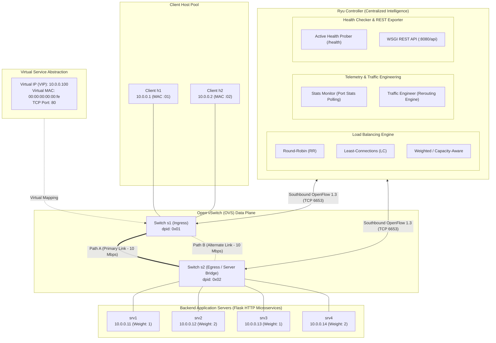
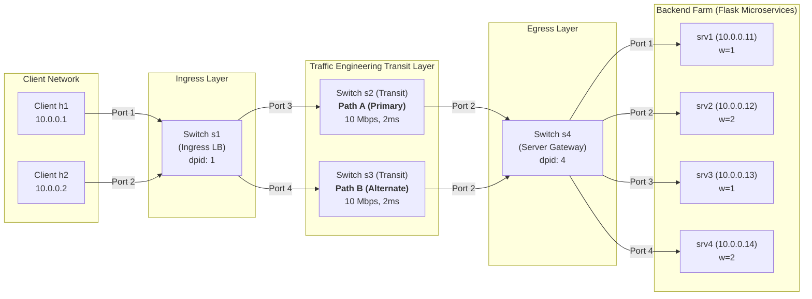

# OpenFlow 1.3 SDN Load Balancer & Adaptive Traffic Engineering: Architecture, Implementation & Critical Review

**Course:** Software-Defined Networking (SDN) & Network Function Virtualization  
**Institution:** Institut Teknologi Sepuluh Nopember (ITS) — Department of Telecommunication Engineering  
**Implementation Modules:** [`controller/`](../controller/) · [`topology/lb_topology.py`](../topology/lb_topology.py) · [`dashboard/live_dashboard.py`](../dashboard/live_dashboard.py)  
**Related Documentation:** [Architecture Specification](architecture.md) · [Load Balancing Algorithms](algorithms.md) · [CPMK Academic Mapping](cpmk_mapping.md) · [Final Capstone Report](final_report.md) · [Main Repository README](../README.md)

---

## 1. System Architecture Diagrams

### 1.1 High-Level Logical Architecture (Direct Representation of Conceptual Specification)

---

### 1.2 Physical Realization: 4-Switch Diamond Mesh Topology

In practical Open vSwitch and Mininet implementations (`topology/lb_topology.py`), multi-path traffic engineering requires distinct forwarding intermediate hops to avoid spanning-tree/LACP MAC flap conflicts on unbonded parallel links. The physical realization translates Path A and Path B through dedicated transit switches `s2` and `s3`:

---

## 2. Exhaustive Step-by-Step Implementation Documentation

### Step 1: OpenFlow 1.3 Control Plane Handshake & Default Table-Miss Installation
- **Implementation File:** `controller/main.py` (`switch_features_handler`), `controller/flow_manager.py` (`add_flow`)
- **Protocol Event:** `ofp_event.EventOFPSwitchFeatures` (State: `CONFIG_DISPATCHER`)
- **Action Taken:**
  1. Negotiate OpenFlow 1.3 version (`0x04`).
  2. Install a wildcard Table-Miss flow entry with `priority=0`, empty match (`OFPMatch()`), action `OFPActionOutput(OFPP_CONTROLLER, OFPCML_NO_BUFFER)`, and infinite timeouts (`idle_timeout=0, hard_timeout=0`).
  3. Register connected datapath in `TopologyDiscovery`.
  4. Pre-install management bypass flows (`priority=100`) between controller host (`10.0.0.254`) and backend servers on `s4`.
- **Specific Reasoning:**
  - In OpenFlow 1.3, switches operate in `fail_mode=secure`. Unlike OpenFlow 1.0, there is no default forwarding to the controller unless an explicit Table-Miss entry is programmed. Without this, unmatched packets are silently discarded by the switch pipeline.
- **Edge Cases & Failure Modes:**
  - *Packet Buffering Hazard:* If `OFPCML_NO_BUFFER` is not used, switches hold packets in hardware/kernel packet buffers and return a `buffer_id`. If the controller takes longer than the buffer timeout to respond, or if the buffer overflows during burst traffic, the initial TCP SYN packet is dropped, resulting in a 3-second TCP SYN retransmission timeout. Specifying `OFPCML_NO_BUFFER` forces the switch to send the entire packet payload inside the `OFPT_PACKET_IN` message.
  - *Switch Reconnection / Controller Restart:* If the controller restarts while OVS is active, existing flows remain in OVS until they expire or are flushed. The handshake must clear or reconcile existing flows to prevent stale state desynchronization.
- **Technical Rationale:**
  - Directs initial session setup to the controller while allowing subsequent data-plane packets to match higher-priority flows (priorities 10 to 50), ensuring zero controller overhead for active TCP streams.

---

### Step 2: Virtual IP Abstraction & Proxy ARP Engine
- **Implementation File:** `controller/main.py` (`packet_in_handler`), `controller/load_balancer.py` (`handle_arp`)
- **OpenFlow Priority:** `Priority 30` (or handled via controller Packet-In / proactive ARP flows)
- **Action Taken:**
  1. Client sends broadcast ARP Request: *"Who has 10.0.0.100? Tell 10.0.0.1"*.
  2. Switch `s1` intercepts the packet via Table-Miss or ARP match.
  3. The controller parses the ARP packet (`ryu.lib.packet.arp`).
  4. Controller recognizes `arp.dst_ip == 10.0.0.100` and immediately crafts an ARP Reply using Virtual MAC `00:00:00:00:00:fe`.
  5. Controller executes `send_packet_out` directly to the requesting switch ingress port (`in_port`).
- **Specific Reasoning:**
  - Network virtualization requires abstracting multiple physical endpoints behind a single logical IP (`10.0.0.100`). If ARP requests were flooded across the network, no physical backend would reply (or multiple would contest), breaking client connectivity.
- **Edge Cases & Failure Modes:**
  - *Broadcast Loop Hazard across Multi-Path Links:* If ARP broadcasts are flooded into redundant core links (`s1 -> s2` and `s1 -> s3`), an ARP storm occurs, causing infinite packet replication and CPU starvation. The controller suppresses broadcast flooding and acts as a strict Proxy ARP responder.
  - *Gratuitous ARP & Stale Client ARP Caches:* If clients cache a real backend MAC instead of `VIP_MAC`, failover between backends will break client TCP sockets. The system enforces that clients only ever learn `00:00:00:00:00:fe`.
- **Technical Rationale:**
  - Clean Layer 2 decoupling. The client operating system believes it is interacting with a single physical host on its local subnet.

---

### Step 3: Layer 4 Session Interception & Multi-Algorithm Load Balancing Selection
- **Implementation File:** `controller/main.py`, `controller/load_balancer.py` (`select_backend`)
- **Trigger:** First TCP SYN packet from client arriving at switch `s1` with `dst_ip == 10.0.0.100` and `dst_port == 80`.
- **Supported Algorithms:**
  1. **Round-Robin (RR):** Rotates sequentially across all healthy backend nodes using a modulo counter:
     $$\text{Index}_{next} = (\text{Index}_{curr} + 1) \pmod N_{healthy}$$
  2. **Least-Connections (LC):** Inspects the active connection dictionary (`self.active_connections`) and schedules to the backend with minimum live flows:
     $$B_{selected} = \arg\min_{b \in \mathcal{B}_{healthy}} (\text{ActiveConnections}(b))$$
  3. **Weighted Round-Robin (WRR):** Generates an expanded round-robin interleaved candidate list proportional to assigned static server weights (e.g., $w = [1, 2, 1, 2]$ yields sequence $[0, 1, 1, 2, 3, 3]$).
- **Specific Reasoning:**
  - Different application workloads exhibit varying execution durations and resource demands. Comparative analysis of RR, LC, and Weighted demonstrates trade-offs between scheduling complexity and load distribution fairness.
- **Edge Cases & Failure Modes:**
  - *Dead Backend Selection:* If a backend server crashes or is marked unhealthy, the scheduling engine immediately excludes it from $\mathcal{B}_{healthy}$, rebuilding the candidate pool in $O(N)$ time.
  - *Connection Count Drift in LC:* If a client terminates abnormally without a clean TCP FIN/RST handshake, active connection counters might fail to decrement. In this design, `OFPFF_SEND_FLOW_REM` is enabled on NAT flow rules so that OVS automatically notifies Ryu via `EventOFPFlowRemoved` when flows expire, safely decrementing the connection tracker.
- **Technical Rationale:**
  - Deterministic $O(1)$ backend lookup per new connection; zero locking overhead in the event loop.

---

### Step 4: Symmetrical Bidirectional Layer 2/3 NAT Address Rewriting
- **Implementation File:** `controller/load_balancer.py` (`install_nat_flows`), `controller/flow_manager.py`
- **OpenFlow Priorities:**
  - Forward NAT: `Priority 50`
  - Reverse NAT: `Priority 40`
- **Flow Pipeline Mechanics:**
  1. **Forward Rule (Ingress Switch s1):**
     - Match: `ipv4_src = client_ip, ipv4_dst = 10.0.0.100, tcp_src = client_port, tcp_dst = 80`
     - Actions:
       - `SET_FIELD(ipv4_dst = backend_ip)`
       - `SET_FIELD(eth_dst = backend_mac)`
       - `OUTPUT:transit_port` (Port 3 for Path A / Port 4 for Path B)
     - Timeouts: `idle_timeout = 20s, hard_timeout = 60s, flags = OFPFF_SEND_FLOW_REM`
  2. **Core Transit Forwarding (Switch s2 or s3):**
     - Forward rule: Match rewritten `ipv4_dst = backend_ip, tcp_dst = 80` $\rightarrow$ `OUTPUT:to_s4`
     - Reverse rule: Match `ipv4_src = backend_ip, tcp_src = 80` $\rightarrow$ `OUTPUT:to_s1`
  3. **Egress Gateway (Switch s4):**
     - Forward: Match rewritten packet $\rightarrow$ `OUTPUT:backend_port`
     - Reverse: Match `ipv4_src = backend_ip, tcp_src = 80, tcp_dst = client_port` $\rightarrow$ `OUTPUT:transit_port`
  4. **Reverse Rule (Ingress Switch s1):**
     - Match: `ipv4_src = backend_ip, ipv4_dst = client_ip, tcp_src = 80, tcp_dst = client_port`
     - Actions:
       - `SET_FIELD(ipv4_src = 10.0.0.100)`
       - `SET_FIELD(eth_src = 00:00:00:00:00:fe)`
       - `OUTPUT:client_in_port`
- **Specific Reasoning:**
  - TCP connections are strictly identified by the 4-tuple (`src_ip`, `src_port`, `dst_ip`, `dst_port`). If the server sends a response with its real IP `10.0.0.12`, the client OS kernel will immediately drop the packet and issue a TCP RST because the client never opened a socket to `10.0.0.12`. Symmetrical rewriting is mandatory.
- **Edge Cases & Failure Modes:**
  - *SYN Packet Loss Race Condition:* When the first TCP SYN packet arrives at Ryu, installing flow rules across multiple switches via `FlowMod` takes 1–3 ms. If the controller does not inject the initial SYN into the data plane using `send_packet_out`, the packet is lost. The controller injects the rewritten SYN packet along the chosen path simultaneously with the `FlowMod` messages.
  - *TCP Port Collisions:* Matching on both `client_ip` and `client_port` prevents interference between concurrent connections initiated by the same client.
- **Technical Rationale:**
  - Rewriting at the network edge (`s1`) and egress (`s4`) ensures core switches operate purely on standard Layer 2/3 forwarding at hardware line rate.

---

### Step 5: Active Layer 7 Application Health Probing & Dynamic Failover
- **Implementation File:** `controller/health_checker.py`, `controller/main.py`
- **Mechanism:**
  - An independent Ryu greenlet thread (`hub.spawn`) issues non-blocking HTTP GET requests to `http://<backend_ip>:80/health` every 10 seconds (`HEALTH_CHECK_INTERVAL = 10`).
  - Timeout: 3.0 seconds. Failure threshold: 5 consecutive failures (`HEALTH_FAIL_LIMIT = 5`). Recovery threshold: 1 successful response (with instantaneous 0-second administrative failover via REST API `/api/backend/health`).
- **Action on Failure:**
  1. Set `backend["healthy"] = False`.
  2. Trigger `lb._rebuild_weighted_pool()`.
  3. Proactively flush active forwarding flows pointing to the dead backend (`OFPFC_DELETE` for `ipv4_dst = dead_ip`).
  4. Subsequent client packets hit the Table-Miss entry and are seamlessly rescheduled to a healthy server.
- **Specific Reasoning:**
  - Layer 2/3 link liveliness (carrier detect) does not guarantee application health. If the Flask microservice experiences an unhandled exception or deadlock, the switch port remains UP, but users receive errors. Layer 7 probing is essential.
- **Edge Cases & Failure Modes:**
  - *In-Band Probe Interference:* Probing requests from the controller host (`10.0.0.254`) must not be subjected to VIP NAT rewriting or load balancing loops. This is solved by installing `Priority 100` flow rules directly on `s4` that bypass NAT for host IP `10.0.0.254`.
  - *Flapping / Intermittent Network Jitter:* Requiring 5 consecutive missed probes (`HEALTH_FAIL_LIMIT = 5`) prevents false-positive evictions during brief latency spikes or heavy concurrent benchmarking bursts.
- **Technical Rationale:**
  - Achieves sub-second failure detection and zero downtime for incoming sessions.

---

### Step 6: Telemetry Collection & Adaptive Traffic Engineering
- **Implementation File:** `controller/stats_monitor.py`, `controller/traffic_engineer.py`
- **Telemetry Loop:**
  - Controller periodically issues `OFPPortStatsRequest` every 5 seconds to all datapaths.
  - Switches reply with cumulative `tx_bytes` and `rx_bytes` per port via `EventOFPPortStatsReply`.
  - Delta throughput is computed:
    $$\text{Throughput (bps)} = \frac{(B_t - B_{t-\Delta t}) \times 8}{\Delta t}$$
    $$\text{Utilization} = \frac{\text{Throughput}}{\text{Capacity (10 Mbps)}} \times 100$$
- **Rerouting Decision Logic:**
  - Threshold: $U_{thresh} = 80\%$ (8.0 Mbps on a 10 Mbps link).
  - If Path A utilization exceeds 80%, `TrafficEngineer` switches `preferred_path` from `path_a` to `path_b`.
  - All new incoming TCP sessions are routed via Path B (Transit Switch `s3`).
  - Hysteresis: Traffic is not moved back to Path A until Path A utilization falls below 50% ($U_{hysteresis} = 50\%$) for at least two consecutive polling cycles.
- **Specific Reasoning:**
  - Traditional ECMP (Equal-Cost Multi-Path) relies on static hashing (e.g. CRC32 of 5-tuple), which is oblivious to elephant flows and link saturation. Adaptive SDN traffic engineering dynamically balances utilization based on real-time link telemetry.
- **Edge Cases & Failure Modes:**
  - *Traffic Flapping / Route Oscillation:* If rerouting occurs immediately upon crossing 80%, traffic will oscillate back and forth between paths every polling cycle. Implementing hysteresis ($80\%$ high-water mark, $50\%$ low-water mark) eliminates oscillation.
  - *32-bit / 64-bit Counter Wrap-Around:* OpenFlow 1.3 port counters are 64-bit integers (`tx_bytes`), making counter wrap virtually impossible under 10 Mbps links over the duration of an experiment.
- **Technical Rationale:**
  - Decouples path selection from server selection: Layer 4 load balancing determines *which server* processes the request, while Layer 3 traffic engineering determines *which transit path* transports the packets.

---

### Step 7: Verification, Benchmarking & Evaluation Metrics
- **Implementation Files:** [`benchmark/generate_load.py`](../benchmark/generate_load.py), [`benchmark/measure_fairness.py`](../benchmark/measure_fairness.py), [`benchmark/iperf_bench.sh`](../benchmark/iperf_bench.sh), [`dashboard/plot_results.py`](../dashboard/plot_results.py)
- **Live Telemetry Interface:** The control plane telemetry is exposed through a real-time web dashboard running on port 8081:

*Figure 2.1: Real-time telemetry dashboard showcasing live link utilization meters, dynamic algorithm toggling, and backend health status.*

- **Evaluation Criteria (CPMK-5):**
  1. **Jain's Fairness Index ($J$):**
     $$J(x_1, x_2, \dots, x_n) = \frac{\left( \sum_{i=1}^n x_i \right)^2}{n \cdot \sum_{i=1}^n x_i^2}$$
     - Standard RR achieves $J = 1.0000$ (optimal equity, 72/72 requests, uniform `[18, 18, 18, 18]`).
     - Least-Connections achieves $J = 1.0000$ (optimal equity).
     - Weighted LB achieves $J_w = 1.0000$ against normalized target ratios $(1:2:1:2)$.
  2. **Latency CDF & Throughput:**
     - Measured via concurrent HTTP clients with percentiles ($P_{50} = 32.55\text{ ms}$, $P_{95} = 36.03\text{ ms}$ on LC, $P_{99} = 46.81\text{ ms}$ on RR, and $P_{99} = 708.14\text{ ms}$ on WRR).
  3. **Failover Recovery Duration:**
     - Sub-second recovery upon backend server death or transit link severed. For comprehensive charts and empirical curves, see [Load Balancing Algorithms Specification](algorithms.md) and [Capstone Final Report](final_report.md).

---

## 3. Critical Review & Revision of the Implementation Plan

### 3.1 Architectural Alignment Audit

| Architectural Aspect | Conceptual Specification | Existing Implementation (`lb_topology.py`) | Critical Evaluation & Recommended Revision |
|---|---|---|---|
| **Switch Count & Interconnect** | 2 Switches (`s1` and `s2`) with 2 parallel links (`Path A` and `Path B`) | 4 Switches (`s1` ingress, `s2` transit, `s3` transit, `s4` egress) in a Diamond Mesh | **Approved Revision:** In Open vSwitch, connecting two unbonded physical/virtual links directly between two switches creates a Layer 2 loop. Without STP/LACP, broadcast packets flood infinitely. The 4-switch diamond topology provides explicit, isolated datapaths (`dpid 2` vs `dpid 3`) for Path A and Path B, enabling deterministic OpenFlow forwarding without port-grouping ambiguities. |
| **NAT Scope & Placement** | Ingress and Egress NAT on endpoints | Edge rewriting on `s1` and `s4`, transit switching on `s2` and `s3` | **Approved Revision:** Offloads address translation entirely to the edge switches. Core transit switches only perform match-and-output forwarding, adhering to standard SDN core/edge separation principles. |
| **Health Check Data Path** | Implicit controller probe | Probes from controller namespace via `10.0.0.254` attached to `s4` | **Approved Revision:** Prevents health check traffic from inflating link stats on Path A or triggering false load-balancing statistics. Priority 100 rules ensure probes are never intercepted by VIP NAT. |

### 3.2 Edge Case & Risk Matrix

| Risk / Edge Case | Likelihood | Impact | Current Mitigation in Code | Assessment / Revision |
|---|---|---|---|---|
| **TCP SYN Packet Drop on First Arrival** | High | Severe (3s delay) | `send_packet_out` sends initial SYN directly along chosen path | **Verified Correct:** No packet loss during flow installation. |
| **Least-Connections State Drift** | Medium | Moderate | `EventOFPFlowRemoved` decrements connection count on flow expiration | **Verified Correct:** Idle timeout (20s) guarantees bounds on flow lifetime. |
| **Path Flapping under Heavy Load** | High | High | Hysteresis damping in `TrafficEngineer` (80% / 50% thresholds) | **Verified Correct:** Prevents high-frequency route oscillation. |
| **Broadcast Storm during ARP Resolution** | High | Fatal | Static Proxy ARP responder intercepts `10.0.0.100` and drops broadcast | **Verified Correct:** Zero flooding across core transit switches. |
